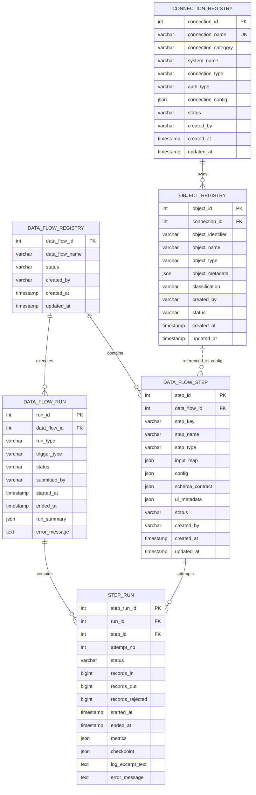

# ETL/ELT Platform Master Development Contract — Production Runtime

Runtime style: Pure backend PySpark runtime package with CLI/importable control-table execution runner

---

## 1. Product Contract

This document is the master development contract for a control-table-driven ETL/ELT platform using PySpark DataFrames.

The platform supports:

- connection testing,
- live object discovery,
- selected object onboarding into `OBJECT_REGISTRY`,
- object preview,
- block preview during canvas editing,
- full data-flow execution,
- schema inference from `df.schema`,
- explicit target verification and creation,
- target registration in `OBJECT_REGISTRY`,
- run and step status tracking,
- Azure Key Vault based secret resolution,
- production-ready runtime code.

The external control plane owns:

- HTTP routes and request validation,
- user/session/RBAC checks,
- metadata CRUD,
- metadata table DDL and migrations,
- transaction handling,
- preview debounce/cancel behavior,
- response shaping for frontend,
- orchestration scheduling in a later phase.

The PySpark runtime package owns reusable execution helpers and the flow execution runner:

- CLI entrypoint for preview and normal runs,
- Spark session creation for CLI/runtime execution,
- automatic loading of local Spark JARs from the runtime `jars/` folder,
- connection test helpers,
- object discovery helpers,
- object preview helpers,
- object registry payload builders,
- block execution using PySpark DataFrames,
- DAG planning from control-table step rows,
- target verify/create helpers,
- safe error objects,
- structured logging helpers,
- MySQL control-table fetch for preview and run,
- run and step status writeback for execution calls,
- schema-contract writeback after successful preview or run.

The runtime package must not own:

- HTTP route definitions,
- SQLAlchemy models,
- metadata migrations,
- metadata table creation,
- metadata table seed data,
- long-term preview storage,
- discovery cache tables,
- tenant/workspace/user-session logic,
- arbitrary Python script execution,
- arbitrary SQL outside the guarded `EXPERT_SQL` block.

---

## 2. Core Design Rules

| Area | Decision |
|---|---|
| Runtime engine | PySpark DataFrame API. |
| Control-plane owner | External control plane owns request lifecycle, metadata persistence, and transactions. |
| Runtime owner | Importable Python package plus CLI with execution helpers and one control-table runner file. |
| Metadata source | Externally managed MySQL control tables. |
| Control-table runner | `runtime/flow_runtime.py` is the only runtime file that connects to MySQL control tables. |
| CLI/control-plane trigger style | CLI or external control plane calls preview and run with IDs, request id, actor, and runtime options only. |
| Runtime input | CLI/control plane passes ID-only request JSON. Runtime fetches the required control-table bundle from MySQL. |
| SQLAlchemy | Not required in runtime. External control plane can use any DB layer it chooses. |
| Connection environment | No `environment` column in `CONNECTION_REGISTRY`. Deployment environment is outside row-level metadata. |
| Secrets | All secrets are resolved from Azure Key Vault. Control tables store only Key Vault references. |
| Preview | Runtime-only response. Preview records are never persisted. |
| Object discovery | Live response. Only selected objects are persisted. |
| Target create | Explicit action based on DDL, incoming schema, partition columns, target object metadata, and target properties. Not environment-gated. |
| Target object registry | Every target used by a target block must have an `OBJECT_REGISTRY` row. |
| Graph model | `input_map` is the single source of truth for all step connectivity. 
| Step dispatch | Use `step_type` only. No `plugin_name` column. |
| Schema contract | Store and return only Spark `StructType.jsonValue()` from `df.schema`. |
| Frontend schema rendering | Frontend/API can derive display columns, simple strings, labels, icons, and validation messages from Spark schema JSON. Backend does not store duplicate schema formats. |
| New functionality | Prefer JSON config + compact block logic over new tables. |

---

## 3. Software Baseline

| Item | Value | Notes |
|---|---|---|
| Python | `3.12.10` | Pin using `.python-version`. Spark 4.1.x supports Python 3.10+, so Python 3.12 is acceptable. |
| Package manager | `uv` | Use `pyproject.toml`, `uv.lock`, `uv sync`, `uv run`. |
| Java/JDK | Java 17 or Java 21 | Required by Spark 4.1.x. `JAVA_HOME` must be set on driver and executor hosts. |
| Scala/JVM artifact line | Scala 2.13 | Required for Spark 4.1.x JVM-side artifacts and external Spark packages. |
| Spark runtime | `pyspark==4.1.2` | Distributed DataFrame execution. |
| Runtime interface | CLI plus importable Python functions | This backend package does not ship HTTP routes or a web server. |
| Metadata DB access | `mysql-connector-python` from `runtime/flow_runtime.py` | Runtime does not require SQLAlchemy or ORM models. |
| Spark JDBC drivers | Runtime `jars/` folder or explicit `--jars-dir` | Required for JDBC source/target access, for example MySQL Connector/J for `com.mysql.cj.jdbc.Driver`. Python `mysql-connector-python` is only for control-table access. |
| File/lakehouse connector artifacts | Deployment-provided Spark/Hadoop packages | Required when enabling S3, GCS, ADLS, Delta, Iceberg, or Hudi. Keep package versions compatible with Spark `4.1.2` and Scala `2.13`. |
| REST client | `requests` | REST connector support. |
| Secret provider | Azure Key Vault | Metadata stores only Key Vault secret names or URIs. |
| MySQL control client | `mysql-connector-python` | Used only by `runtime/flow_runtime.py` to read/write control tables. |
| Azure identity | `azure-identity` | Managed identity or service-principal authentication. |
| Key Vault SDK | `azure-keyvault-secrets` | Secret retrieval from Azure Key Vault. |
| Lint/format | `ruff` | Common team formatting and linting. |
| Logging | Python `logging` | JSON-friendly structured fields through `utils/logging.py`. |

Runtime package dependencies:

| Dependency | Purpose |
|---|---|
| `pyspark==4.1.2` | DataFrame runtime. |
| `requests>=2.32` | REST connector support. |
| `azure-identity>=1.16` | Azure authentication. |
| `azure-keyvault-secrets>=4.8` | Secret retrieval from Azure Key Vault. |
| `ruff>=0.11` | Development lint/format standard. |
| `mysql-connector-python>=9.0` | MySQL control-table access from `runtime/flow_runtime.py`. |
| `python-dotenv>=1.0` | Optional local environment loading for CLI/runtime development. |

Optional Spark connector profiles are deployment profiles, not implicit core dependencies:

| Profile | Required rule |
|---|---|
| JDBC sources/targets | Add the matching JDBC driver JAR to `UMC_Backend_ETL/jars/` or pass `--jars-dir`. |
| S3/GCS/ADLS file access | Add the matching Hadoop/cloud connector JARs to the runtime jars folder and configure credentials through approved secret or managed-identity paths. |
| Delta Lake | Add Delta artifacts compatible with Spark `4.1.2` and Scala `2.13`, and configure the required Spark SQL extensions/catalog settings. |
| Iceberg | Add Iceberg runtime artifacts compatible with Spark `4.1.2` and Scala `2.13`, and configure catalog settings. |
| Hudi | Add Hudi Spark bundle compatible with Spark `4.1.2` and Scala `2.13`, and configure write/read options. |

---

## 4. Platform Ownership Boundary

| Capability | External control plane ownership | Runtime package ownership |
|---|---|---|
| Save connection | Validate form and write `CONNECTION_REGISTRY`. | None. |
| Test connection | Build request payload, call runtime, optionally persist status. | Resolve secrets, test connectivity, return safe response. |
| Discover objects | Authorize user, call runtime, display candidates. | List candidate objects from connection. |
| Onboard objects | Insert/update selected `OBJECT_REGISTRY` rows. | Normalize selected candidates into object row payloads. |
| Save flow | Write `DATA_FLOW_REGISTRY` and `DATA_FLOW_STEP`. | None. |
| Preview step | Save latest config first, then call runtime with `data_flow_id` and `step_id`. | Fetch flow bundle from MySQL, execute required upstream path, update schema contracts, and return sample/schema. |
| Run flow | Authorize and call runtime with `data_flow_id`, trigger details, and request id. | Create run/step rows, fetch flow bundle from MySQL, execute DAG, and update run/step statuses. |
| Target verify/create | Call runtime, save returned target object metadata when needed. | Verify/create target structure only for explicit action. |
| Target block save | Ensure target object exists in `OBJECT_REGISTRY`, then save `DATA_FLOW_STEP`. | Validate target block can resolve `target_object_id`. |

---

## 5. Metadata Table Conventions

| Convention | Rule |
|---|---|
| Primary keys | `INT AUTO_INCREMENT`; use `BIGINT` only where scale requires it. |
| JSON columns | Store JSON objects unless explicitly documented as arrays. |
| Secrets | Store only Azure Key Vault references, never secret values. |
| Actor fields | `created_by` and `submitted_by` are strings supplied by External control plane. |
| Timestamps | `created_at` default current timestamp; `updated_at` auto-updated. |
| Status values | Status means operational lifecycle only. |
| Preview rows | Never store preview sample records. |
| Discovery results | Never bulk-store discovery candidates. Persist only selected objects. |
| Runtime metadata writes | Runtime writes run rows, step-run rows, and step schema contracts for preview/run execution calls. External control plane owns user-facing CRUD, DDL/migrations, and target-object registry persistence from returned target-action payloads. |
| Schema | Backend schema value is the Spark `StructType.jsonValue()` object only. |

---

## 6. Control Tables ERD



Physical foreign keys are represented by declared id columns. `DATA_FLOW_STEP.config.source_object_id` and `DATA_FLOW_STEP.config.target_object_id` are logical references to `OBJECT_REGISTRY.object_id`; they are stored inside JSON and must be validated by External control plane on save and by runtime before execution.

---

## 7. Control Table Structures

### 7.1 `CONNECTION_REGISTRY`

Purpose: stores reusable connection definitions. It stores no raw secret values and no environment column.

| Column | Type | Required | Allowed values / rule | Purpose |
|---|---|---:|---|---|
| `connection_id` | `INT` | Yes | PK | Connection id. |
| `connection_name` | `VARCHAR(150)` | Yes | Unique | Stable connection name. |
| `connection_category` | `VARCHAR(50)` | Yes | `DATABASE`, `FILE_SYSTEM`, `REST_API`, `LAKEHOUSE` | Connection family. |
| `system_name` | `VARCHAR(80)` | Yes | See enum catalog | Source/target platform. |
| `connection_type` | `VARCHAR(80)` | Yes | See enum catalog | Runtime connector type. |
| `auth_type` | `VARCHAR(80)` | Yes | See enum catalog | Authentication style. |
| `connection_config` | `JSON` | Yes | Object | Connector details and Key Vault references. |
| `status` | `VARCHAR(50)` | Yes | `ACTIVE`, `INACTIVE`, `INVALID` | Operational status. |
| `created_by` | `VARCHAR(255)` | Yes | Actor string | Creator. |
| `created_at` | `TIMESTAMP` | Yes | Default current timestamp | Created timestamp. |
| `updated_at` | `TIMESTAMP` | Yes | Auto update | Updated timestamp. |

Sample records:

| connection_id | connection_name | connection_category | system_name | connection_type | auth_type | status |
|---:|---|---|---|---|---|---|
| 1 | `mysql_sales` | `DATABASE` | `MYSQL` | `JDBC` | `USER_PASSWORD_REF` | `ACTIVE` |
| 2 | `s3_landing` | `FILE_SYSTEM` | `S3` | `S3` | `SECRET_REF` | `ACTIVE` |
| 3 | `customer_rest_api` | `REST_API` | `REST` | `REST` | `BEARER_TOKEN_REF` | `ACTIVE` |
| 4 | `delta_gold` | `LAKEHOUSE` | `DELTA` | `DELTA` | `MANAGED_IDENTITY` | `ACTIVE` |

Sample JSON row:

```json
{
  "connection_id": 1,
  "connection_name": "mysql_sales",
  "connection_category": "DATABASE",
  "system_name": "MYSQL",
  "connection_type": "JDBC",
  "auth_type": "USER_PASSWORD_REF",
  "connection_config": {
    "jdbc_url": "jdbc:mysql://mysql.company.local:3306/sales",
    "driver_class": "com.mysql.cj.jdbc.Driver",
    "database_name": "sales",
    "default_schema": "sales",
    "username_ref": {
      "vault_url": "https://kv-etl.vault.azure.net/",
      "secret_name": "mysql-sales-username",
      "version": null
    },
    "password_ref": {
      "vault_url": "https://kv-etl.vault.azure.net/",
      "secret_name": "mysql-sales-password",
      "version": null
    },
    "read_options": {
      "fetchsize": 10000,
      "queryTimeout": 300
    },
    "object_discovery": {
      "enabled": true,
      "default_object_types": ["TABLE", "VIEW"],
      "include_patterns": ["sales.*"],
      "exclude_patterns": ["tmp_*"],
      "max_objects": 500,
      "infer_schema_during_discovery": false
    }
  },
  "status": "ACTIVE",
  "created_by": "developer@company.com"
}
```

`connection_config` possible keys and values:

| Key | Type | Required | Possible values | Default | Meaning |
|---|---|---:|---|---|---|
| `jdbc_url` | string | JDBC only | Valid JDBC URL | None | Spark JDBC URL. |
| `driver_class` | string | JDBC only | Driver class name | None | JDBC driver. |
| `database_name` | string/null | No | Database/catalog name | `null` | Database name. |
| `default_schema` | string/null | No | Schema name | `null` | Default schema. |
| `base_path` | string | File/lake paths | `s3://`, `abfss://`, `gs://`, local path | None | Storage root. |
| `base_url` | string | REST only | HTTP/HTTPS URL | None | REST API base URL. |
| `username_ref` | object/null | No | Key Vault reference | `null` | Username secret reference. |
| `password_ref` | object/null | No | Key Vault reference | `null` | Password secret reference. |
| `api_token_ref` | object/null | No | Key Vault reference | `null` | Token secret reference. |
| `read_options` | object | No | Spark/connector read options | `{}` | Connector-specific read hints. |
| `write_options` | object | No | Spark/connector write options | `{}` | Connector-specific write hints. |
| `object_discovery` | object | No | Discovery settings | `{}` | Live discovery defaults. |

---

### 7.2 `OBJECT_REGISTRY`

Purpose: stores selected source objects and target objects. A target block must reference a target object row.

| Column | Type | Required | Allowed values / rule | Purpose |
|---|---|---:|---|---|
| `object_id` | `INT` | Yes | PK | Object id. |
| `connection_id` | `INT` | Yes | FK to `CONNECTION_REGISTRY` | Owning connection. |
| `object_identifier` | `VARCHAR(500)` | Yes | Unique per connection | Physical object identifier. |
| `object_name` | `VARCHAR(150)` | Yes | Display string | Human-readable name. |
| `object_type` | `VARCHAR(80)` | Yes | See enum catalog | Source or target object type. |
| `object_metadata` | `JSON` | Yes | Object | Physical metadata and schema. |
| `classification` | `VARCHAR(50)` | No | `PUBLIC`, `INTERNAL`, `CONFIDENTIAL`, `RESTRICTED`, `null` | Sensitivity classification. |
| `created_by` | `VARCHAR(255)` | Yes | Actor string | Creator. |
| `status` | `VARCHAR(50)` | Yes | `ACTIVE`, `INACTIVE`, `INVALID` | Operational status. |
| `created_at` | `TIMESTAMP` | Yes | Default current timestamp | Created timestamp. |
| `updated_at` | `TIMESTAMP` | Yes | Auto update | Updated timestamp. |

Sample records:

| object_id | connection_id | object_identifier | object_name | object_type | status |
|---:|---:|---|---|---|---|
| 101 | 1 | `sales.orders` | Orders Source | `TABLE` | `ACTIVE` |
| 102 | 1 | `sales.customers` | Customers Source | `TABLE` | `ACTIVE` |
| 201 | 4 | `gold.fact_customer_orders` | Fact Customer Orders Target | `TARGET_TABLE` | `ACTIVE` |

Sample JSON row:

```json
{
  "object_id": 201,
  "connection_id": 4,
  "object_identifier": "gold.fact_customer_orders",
  "object_name": "Fact Customer Orders Target",
  "object_type": "TARGET_TABLE",
  "object_metadata": {
    "physical_exists": true,
    "catalog_name": "spark_catalog",
    "database_name": "gold",
    "schema_name": "gold",
    "table_name": "fact_customer_orders",
    "full_name": "gold.fact_customer_orders",
    "table_format": "delta",
    "schema_contract": {
      "type": "struct",
      "fields": [
        {"name": "customer_id_hash", "type": "string", "nullable": true, "metadata": {}},
        {"name": "customer_segment", "type": "string", "nullable": true, "metadata": {}},
        {"name": "total_amount", "type": "decimal(28,2)", "nullable": true, "metadata": {}},
        {"name": "order_count", "type": "long", "nullable": false, "metadata": {}}
      ]
    },
    "primary_keys": ["customer_id_hash"],
    "partition_columns": ["customer_segment"],
    "write_mode": "append"
  },
  "classification": "INTERNAL",
  "created_by": "developer@company.com",
  "status": "ACTIVE"
}
```

`object_metadata` possible keys and values:

| Key | Type | Required | Possible values | Default | Meaning |
|---|---|---:|---|---|---|
| `physical_exists` | bool | Yes | `true`, `false` | `false` | Whether physical object exists. |
| `schema_contract` | object | Yes | Spark `StructType.jsonValue()` | Empty Spark struct | Object schema. |
| `catalog_name` | string/null | No | Catalog/database name | `null` | Spark catalog or database catalog name. |
| `database_name` | string/null | Database/lakehouse | Database/catalog | `null` | Database. |
| `schema_name` | string/null | Database/lakehouse | Schema/database | `null` | Schema. |
| `table_name` | string/null | Table targets/sources | Table name | `null` | Table. |
| `full_name` | string/null | Table targets/sources | Qualified name | `null` | Full table name. |
| `table_format` | string/null | No | `delta`, `iceberg`, `hudi`, `parquet` | `null` | Physical table format. |
| `path` | string/null | File objects | Path/URI | `null` | File or folder path. |
| `file_format` | string/null | File objects | `csv`, `json`, `parquet`, `delta`, `orc`, `text` | `null` | Spark file format. |
| `resource_path` | string/null | REST objects | `/resource` | `null` | REST path. |
| `method` | string/null | REST objects | `GET`, `POST` | `GET` | REST method. |
| `primary_keys` | array[string] | No | Column names | `[]` | Merge/business keys. |
| `partition_columns` | array[string] | No | Column names | `[]` | Target partition columns. |
| `watermark_column` | string/null | No | Column name | `null` | Incremental watermark. |
| `write_mode` | string/null | Target only | `append`, `overwrite`, `merge` | `append` | Default target write behavior. |
| `default_load_type` | string/null | No | `FULL`, `DELTA` | `FULL` | Default load mode for source objects. |

---

### 7.3 `DATA_FLOW_REGISTRY`

Purpose: stores the flow header. Execution policy can be extended in this table in a later phase.

| Column | Type | Required | Allowed values / rule | Purpose |
|---|---|---:|---|---|
| `data_flow_id` | `INT` | Yes | PK | Flow id. |

| `data_flow_name` | `VARCHAR(255)` | Yes | Display string | Flow name. |
| `status` | `VARCHAR(50)` | Yes | `DRAFT`, `ACTIVE`, `PAUSED` | Flow status. |
| `created_by` | `VARCHAR(255)` | Yes | Actor string | Creator. |
| `created_at` | `TIMESTAMP` | Yes | Default current timestamp | Created timestamp. |
| `updated_at` | `TIMESTAMP` | Yes | Auto update | Updated timestamp. |

Sample row:

| data_flow_id | data_flow_name | status | created_by |
|---:|---|---|---|
| 1 | Load Orders To Gold | `ACTIVE` | `developer@company.com` | |

Sample JSON row:

```json
{
  "data_flow_id": 1,
  "data_flow_name": "Load Orders To Gold",
  "status": "ACTIVE",
  "created_by": "developer@company.com"
}
```

Possible keys and values:

| Key | Type | Required | Possible values | Default | Meaning |
|---|---|---:|---|---|---|
| `status` | string | Yes | `DRAFT`, `ACTIVE`, `PAUSED` | `DRAFT` | Flow lifecycle state. |

---

### 7.4 `DATA_FLOW_STEP`

Purpose: stores canvas blocks and graph edges. It uses `step_type` for dispatch and does not need `plugin_name`.

| Column | Type | Required | Allowed values / rule | Purpose |
|---|---|---:|---|---|
| `step_id` | `INT` | Yes | PK | Step id. |
| `data_flow_id` | `INT` | Yes | FK to `DATA_FLOW_REGISTRY` | Parent flow. |
| `step_key` | `VARCHAR(150)` | Yes | Unique per flow | Stable step key. |
| `step_name` | `VARCHAR(255)` | Yes | Display string | Step name. |
| `step_type` | `VARCHAR(80)` | Yes | See enum catalog | Block type and runtime dispatch key. |
| `input_map` | `JSON` | Yes | Object | Single source of truth for all step connectivity. SOURCE steps use `{"inputs": []}`. All other steps must have at least one entry in `inputs[]`. |
| `config` | `JSON` | Yes | Object | Block-specific config. |
| `schema_contract` | `JSON` | Yes | Spark `StructType.jsonValue()` | Last inferred output schema. |
| `ui_metadata` | `JSON` | No | Object or null | Canvas display metadata. |
| `status` | `VARCHAR(50)` | Yes | `DRAFT`, `READY`, `INVALID`, `DISABLED` | Operational status. |
| `created_by` | `VARCHAR(255)` | Yes | Actor string | Creator. |
| `created_at` | `TIMESTAMP` | Yes | Default current timestamp | Created timestamp. |
| `updated_at` | `TIMESTAMP` | Yes | Auto update | Updated timestamp. |

Connectivity rules:

`input_map` is the single source of truth for all step connectivity. The runtime reads only `input_map.inputs[].from_step_id`. 

| Scenario | Rule |
|---|---|
| SOURCE step | `input_map = {"inputs": []}`. No upstream inputs. |
| Single-input step | `input_map.inputs[]` has one entry with `alias="default"` pointing to the upstream step. |
| Fan-out (one step feeds multiple steps) | Each downstream step has its own `input_map` entry referencing the same upstream step id in `inputs[].from_step_id`. No special config needed on the upstream step. |
| JOIN step | `input_map.inputs[]` lists all inputs with distinct aliases e.g. `left`, `right`. |
| UNION step | `input_map.inputs[]` lists all inputs in merge order with distinct aliases. |
| VALIDATION branch consumer | `input_map.inputs[].output_port` must be `valid` or `rejected` to select the correct branch. |

Sample records showing `input_map` as the sole connectivity mechanism (`from_step_id` column dropped):

| step_id | data_flow_id | step_key | step_type | input_map | status |
|---:|---:|---|---|---|---|
| 101 | 1 | `read_orders` | `SOURCE` | `{"inputs": []}` | `READY` |
| 102 | 1 | `filter_orders` | `FILTER` | `{"inputs": [{"alias": "default", "from_step_id": 101, "output_port": "default"}]}` | `READY` |
| 103 | 1 | `select_order_columns` | `SELECT` | `{"inputs": [{"alias": "default", "from_step_id": 102, "output_port": "default"}]}` | `READY` |
| 104 | 1 | `read_customers` | `SOURCE` | `{"inputs": []}` | `READY` |
| 105 | 1 | `select_customer_columns` | `SELECT` | `{"inputs": [{"alias": "default", "from_step_id": 104, "output_port": "default"}]}` | `READY` |
| 106 | 1 | `join_orders_customers` | `JOIN` | `{"inputs": [{"alias": "orders", "from_step_id": 103, "output_port": "default"}, {"alias": "customers", "from_step_id": 105, "output_port": "default"}]}` | `READY` |
| 107 | 1 | `aggregate_customer_orders` | `AGGREGATE` | `{"inputs": [{"alias": "default", "from_step_id": 106, "output_port": "default"}]}` | `READY` |
| 108 | 1 | `protect_customer_id` | `PROTECTION` | `{"inputs": [{"alias": "default", "from_step_id": 107, "output_port": "default"}]}` | `READY` |
| 109 | 1 | `write_fact_customer_orders` | `TARGET` | `{"inputs": [{"alias": "default", "from_step_id": 108, "output_port": "default"}]}` | `READY` |
| 110 | 1 | `validate_joined_orders` | `VALIDATION` | `{"inputs": [{"alias": "default", "from_step_id": 106, "output_port": "default"}]}` | `READY` |

Sample JSON rows for the same flow. `schema_contract` is never `null` for these READY examples; it is the Spark StructType JSON object from `df.schema.jsonValue()`.

```json
[
  {
    "step_id": 101,
    "data_flow_id": 1,
    "step_key": "read_orders",
    "step_name": "Read Orders",
    "step_type": "SOURCE",
    "input_map": {"inputs": []},
    "config": {"source_object_id": 101},
    "schema_contract": {
      "type": "struct",
      "fields": [
        {"name": "order_id", "type": "long", "nullable": true, "metadata": {}},
        {"name": "customer_id", "type": "long", "nullable": true, "metadata": {}},
        {"name": "amount", "type": "decimal(18,2)", "nullable": true, "metadata": {}},
        {"name": "status", "type": "string", "nullable": true, "metadata": {}},
        {"name": "updated_at", "type": "timestamp", "nullable": true, "metadata": {}}
      ]
    },
    "ui_metadata": {"x": 80, "y": 120},
    "status": "READY"
  },
  {
    "step_id": 102,
    "data_flow_id": 1,
    "step_key": "filter_orders",
    "step_name": "Filter Orders",
    "step_type": "FILTER",
    "input_map": {"inputs": [{"alias": "default", "from_step_id": 101, "output_port": "default"}]},
    "config": {
      "conditions": [
        {"column": "status", "operator": "=", "value": "COMPLETE"}
      ]
    },
    "schema_contract": {
      "type": "struct",
      "fields": [
        {"name": "order_id", "type": "long", "nullable": true, "metadata": {}},
        {"name": "customer_id", "type": "long", "nullable": true, "metadata": {}},
        {"name": "amount", "type": "decimal(18,2)", "nullable": true, "metadata": {}},
        {"name": "status", "type": "string", "nullable": true, "metadata": {}},
        {"name": "updated_at", "type": "timestamp", "nullable": true, "metadata": {}}
      ]
    },
    "ui_metadata": {"x": 300, "y": 120},
    "status": "READY"
  },
  {
    "step_id": 103,
    "data_flow_id": 1,
    "step_key": "select_order_columns",
    "step_name": "Select Order Columns",
    "step_type": "SELECT",
    "input_map": {"inputs": [{"alias": "default", "from_step_id": 102, "output_port": "default"}]},
    "config": {
      "columns": ["order_id", "customer_id", "amount", "updated_at"]
    },
    "schema_contract": {
      "type": "struct",
      "fields": [
        {"name": "order_id", "type": "long", "nullable": true, "metadata": {}},
        {"name": "customer_id", "type": "long", "nullable": true, "metadata": {}},
        {"name": "amount", "type": "decimal(18,2)", "nullable": true, "metadata": {}},
        {"name": "updated_at", "type": "timestamp", "nullable": true, "metadata": {}}
      ]
    },
    "ui_metadata": {"x": 520, "y": 120},
    "status": "READY"
  },
  {
    "step_id": 104,
    "data_flow_id": 1,
    "step_key": "read_customers",
    "step_name": "Read Customers",
    "step_type": "SOURCE",
    "input_map": {"inputs": []},
    "config": {"source_object_id": 102},
    "schema_contract": {
      "type": "struct",
      "fields": [
        {"name": "customer_id", "type": "long", "nullable": true, "metadata": {}},
        {"name": "customer_name", "type": "string", "nullable": true, "metadata": {}},
        {"name": "customer_segment", "type": "string", "nullable": true, "metadata": {}},
        {"name": "updated_at", "type": "timestamp", "nullable": true, "metadata": {}}
      ]
    },
    "ui_metadata": {"x": 80, "y": 320},
    "status": "READY"
  },
  {
    "step_id": 105,
    "data_flow_id": 1,
    "step_key": "select_customer_columns",
    "step_name": "Select Customer Columns",
    "step_type": "SELECT",
    "input_map": {"inputs": [{"alias": "default", "from_step_id": 104, "output_port": "default"}]},
    "config": {
      "columns": ["customer_id", "customer_name", "customer_segment"]
    },
    "schema_contract": {
      "type": "struct",
      "fields": [
        {"name": "customer_id", "type": "long", "nullable": true, "metadata": {}},
        {"name": "customer_name", "type": "string", "nullable": true, "metadata": {}},
        {"name": "customer_segment", "type": "string", "nullable": true, "metadata": {}}
      ]
    },
    "ui_metadata": {"x": 300, "y": 320},
    "status": "READY"
  },
  {
    "step_id": 106,
    "data_flow_id": 1,
    "step_key": "join_orders_customers",
    "step_name": "Join Orders And Customers",
    "step_type": "JOIN",
    "input_map": {
      "inputs": [
        {"alias": "orders", "from_step_id": 103, "output_port": "default"},
        {"alias": "customers", "from_step_id": 105, "output_port": "default"}
      ]
    },
    "config": {
      "join_type": "left",
      "left_alias": "orders",
      "right_alias": "customers",
      "conditions": [
        {"left_column": "customer_id", "operator": "=", "right_column": "customer_id"}
      ]
    },
    "schema_contract": {
      "type": "struct",
      "fields": [
        {"name": "order_id", "type": "long", "nullable": true, "metadata": {}},
        {"name": "customer_id", "type": "long", "nullable": true, "metadata": {}},
        {"name": "amount", "type": "decimal(18,2)", "nullable": true, "metadata": {}},
        {"name": "updated_at", "type": "timestamp", "nullable": true, "metadata": {}},
        {"name": "customer_name", "type": "string", "nullable": true, "metadata": {}},
        {"name": "customer_segment", "type": "string", "nullable": true, "metadata": {}}
      ]
    },
    "ui_metadata": {"x": 740, "y": 220},
    "status": "READY"
  },
  {
    "step_id": 107,
    "data_flow_id": 1,
    "step_key": "aggregate_customer_orders",
    "step_name": "Aggregate Customer Orders",
    "step_type": "AGGREGATE",
    "input_map": {"inputs": [{"alias": "default", "from_step_id": 106, "output_port": "default"}]},
    "config": {
      "group_by": ["customer_id", "customer_segment"],
      "aggregations": [
        {"output_column": "total_amount", "function": "sum", "column": "amount"},
        {"output_column": "order_count", "function": "count", "column": "order_id"}
      ]
    },
    "schema_contract": {
      "type": "struct",
      "fields": [
        {"name": "customer_id", "type": "long", "nullable": true, "metadata": {}},
        {"name": "customer_segment", "type": "string", "nullable": true, "metadata": {}},
        {"name": "total_amount", "type": "decimal(28,2)", "nullable": true, "metadata": {}},
        {"name": "order_count", "type": "long", "nullable": false, "metadata": {}}
      ]
    },
    "ui_metadata": {"x": 960, "y": 220},
    "status": "READY"
  },
  {
    "step_id": 108,
    "data_flow_id": 1,
    "step_key": "protect_customer_id",
    "step_name": "Protect Customer Id",
    "step_type": "PROTECTION",
    "input_map": {"inputs": [{"alias": "default", "from_step_id": 107, "output_port": "default"}]},
    "config": {
      "operations": [
        {"column": "customer_id", "action": "HASH", "output_column": "customer_id_hash"}
      ],
      "drop_original_columns": ["customer_id"]
    },
    "schema_contract": {
      "type": "struct",
      "fields": [
        {"name": "customer_id_hash", "type": "string", "nullable": true, "metadata": {}},
        {"name": "customer_segment", "type": "string", "nullable": true, "metadata": {}},
        {"name": "total_amount", "type": "decimal(28,2)", "nullable": true, "metadata": {}},
        {"name": "order_count", "type": "long", "nullable": false, "metadata": {}}
      ]
    },
    "ui_metadata": {"x": 1180, "y": 220},
    "status": "READY"
  },
  {
    "step_id": 109,
    "data_flow_id": 1,
    "step_key": "write_fact_customer_orders",
    "step_name": "Write Fact Customer Orders",
    "step_type": "TARGET",
    "input_map": {"inputs": [{"alias": "default", "from_step_id": 108, "output_port": "default"}]},
    "config": {
      "target_object_id": 201,
      "write_mode": "append"
    },
    "schema_contract": {
      "type": "struct",
      "fields": [
        {"name": "customer_id_hash", "type": "string", "nullable": true, "metadata": {}},
        {"name": "customer_segment", "type": "string", "nullable": true, "metadata": {}},
        {"name": "total_amount", "type": "decimal(28,2)", "nullable": true, "metadata": {}},
        {"name": "order_count", "type": "long", "nullable": false, "metadata": {}}
      ]
    },
    "ui_metadata": {"x": 1400, "y": 220},
    "status": "READY"
  },
  {
    "step_id": 110,
    "data_flow_id": 1,
    "step_key": "validate_joined_orders",
    "step_name": "Validate Joined Orders",
    "step_type": "VALIDATION",
    "input_map": {"inputs": [{"alias": "default", "from_step_id": 106, "output_port": "default"}]},
    "config": {
      "rules": [
        {"rule_name": "amount_positive", "expression": "amount >= 0", "on_fail": "REJECT"}
      ]
    },
    "schema_contract": {
      "type": "struct",
      "fields": [
        {"name": "order_id", "type": "long", "nullable": true, "metadata": {}},
        {"name": "customer_id", "type": "long", "nullable": true, "metadata": {}},
        {"name": "amount", "type": "decimal(18,2)", "nullable": true, "metadata": {}},
        {"name": "updated_at", "type": "timestamp", "nullable": true, "metadata": {}},
        {"name": "customer_name", "type": "string", "nullable": true, "metadata": {}},
        {"name": "customer_segment", "type": "string", "nullable": true, "metadata": {}}
      ]
    },
    "ui_metadata": {"x": 960, "y": 420},
    "status": "READY"
  }
]
```

`input_map`, `config`, `schema_contract`, and `ui_metadata` possible keys and values:

| JSON column | Key | Type | Required | Possible values | Default | Meaning |
|---|---|---|---:|---|---|---|
| `input_map` | `inputs` | array[object] | Multi-input steps | Input references | `[]` | Defines named upstream inputs. |
| `input_map.inputs[]` | `alias` | string | Yes | `left`, `right`, `orders`, `customers`, custom alias | None | Input alias used by block config. |
| `input_map.inputs[]` | `from_step_id` | int | Yes | Existing upstream step id | None | Upstream dependency. |
| `input_map.inputs[]` | `output_port` | string | No | `default`, `valid`, `invalid`, `rejected` | `default` | Output port to consume. |
| `config` | Block-specific | object | Yes | Section 10 | `{}` | Block behavior. |
| `schema_contract` | `type` | string | Yes | `struct` | `struct` | Spark StructType JSON root type. |
| `schema_contract` | `fields` | array[object] | Yes | Spark StructField JSON objects | `[]` | Spark fields from `df.schema.jsonValue()`. |
| `schema_contract.fields[]` | `name` | string | Yes | Column name | None | Column name. |
| `schema_contract.fields[]` | `type` | string/object | Yes | Spark data type JSON | None | Column data type. |
| `schema_contract.fields[]` | `nullable` | bool | Yes | `true`, `false` | `true` | Nullability. |
| `schema_contract.fields[]` | `metadata` | object | Yes | Spark metadata object | `{}` | Spark field metadata. |
| `ui_metadata` | `x`, `y` | number | No | Canvas coordinates | `0` | Node position. |
| `ui_metadata` | `width`, `height` | number | No | Pixel values | UI default | Node size. |
| `ui_metadata` | `collapsed` | bool | No | `true`, `false` | `false` | Canvas display state. |

---

### 7.5 `DATA_FLOW_RUN`

Purpose: stores flow-level execution attempts.

| Column | Type | Required | Allowed values / rule | Purpose |
|---|---|---:|---|---|
| `run_id` | `INT` | Yes | PK | Run id. |
| `data_flow_id` | `INT` | Yes | FK to `DATA_FLOW_REGISTRY` | Executed flow. |
| `run_type` | `VARCHAR(50)` | Yes | `NORMAL_RUN` | Run type. |
| `trigger_type` | `VARCHAR(50)` | Yes | `MANUAL`, `API` | Trigger. |
| `status` | `VARCHAR(50)` | Yes | `QUEUED`, `RUNNING`, `COMPLETED`, `FAILED`, `CANCELLED` | Run lifecycle. |
| `submitted_by` | `VARCHAR(255)` | Yes | Actor string | Submitter. |
| `started_at` | `TIMESTAMP` | No | Nullable | Start timestamp. |
| `ended_at` | `TIMESTAMP` | No | Nullable | End timestamp. |
| `run_summary` | `JSON` | No | Object | Run metrics summary. |
| `error_message` | `TEXT` | No | Nullable, sanitized | Failure message. |

Sample row:

| run_id | data_flow_id | run_type | trigger_type | status | submitted_by |
|---:|---:|---|---|---|---|
| 9001 | 1 | `NORMAL_RUN` | `API` | `COMPLETED` | `operator@company.com` |

JSON row example:

```json
{
  "run_id": 9001,
  "data_flow_id": 1,
  "run_type": "NORMAL_RUN",
  "trigger_type": "API",
  "status": "COMPLETED",
  "submitted_by": "operator@company.com",
  "started_at": "2026-06-10T09:00:00Z",
  "ended_at": "2026-06-10T09:02:31Z",
  "run_summary": {
    "steps_total": 10,
    "steps_completed": 10,
    "records_in": 100000,
    "records_out": 98420,
    "records_rejected": 0,
    "target_actions": [
      {"step_key": "write_fact_customer_orders", "action": "APPEND", "status": "SUCCESS"}
    ]
  },
  "error_message": null
}
```

`run_summary` possible keys and values:

| Key | Type | Required | Possible values | Default | Meaning |
|---|---|---:|---|---|---|
| `steps_total` | int | No | `0..n` | `0` | Steps in run plan. |
| `steps_completed` | int | No | `0..n` | `0` | Completed steps. |
| `records_in` | bigint/null | No | `0..n`, `null` | `null` | Total input rows when known. |
| `records_out` | bigint/null | No | `0..n`, `null` | `null` | Total output rows when known. |
| `records_rejected` | bigint/null | No | `0..n`, `null` | `null` | Total rejected rows. |
| `target_actions` | array[object] | No | Target write summaries | `[]` | Target operation summaries. |
| `warnings` | array[string] | No | Sanitized warnings | `[]` | Non-fatal issues. |

---

### 7.6 `STEP_RUN`

Purpose: stores step-level execution attempts.

| Column | Type | Required | Allowed values / rule | Purpose |
|---|---|---:|---|---|
| `step_run_id` | `INT` | Yes | PK | Step attempt id. |
| `run_id` | `INT` | Yes | FK to `DATA_FLOW_RUN` | Parent run. |
| `data_flow_id` | `INT` | Yes | FK to `DATA_FLOW_REGISTRY` | Parent flow. |
| `step_id` | `INT` | Yes | FK to `DATA_FLOW_STEP` | Attempted step. |
| `attempt_no` | `INT` | Yes | Starts at `1` | Attempt number. |
| `status` | `VARCHAR(50)` | Yes | `QUEUED`, `RUNNING`, `COMPLETED`, `FAILED`, `SKIPPED`, `CANCELLED` | Attempt status. |
| `records_in` | `BIGINT` | No | Nullable | Input rows if available. |
| `records_out` | `BIGINT` | No | Nullable | Output rows if available. |
| `records_rejected` | `BIGINT` | No | Nullable | Rejected rows if available. |
| `started_at` | `TIMESTAMP` | No | Nullable | Start timestamp. |
| `ended_at` | `TIMESTAMP` | No | Nullable | End timestamp. |
| `metrics` | `JSON` | No | Object | Step metrics. |
| `checkpoint` | `JSON` | No | Object | checkpoint. |
| `log_excerpt_text` | `TEXT` | No | Nullable, sanitized | Short runtime log note. |
| `error_message` | `TEXT` | No | Nullable, sanitized | Failure message. |

Sample rows:

| step_run_id | run_id | data_flow_id | step_id | attempt_no | status | records_in | records_out | records_rejected |
|---:|---:|---:|---:|---:|---|---:|---:|---:|
| 9101 | 9001 | 1 | 101 | 1 | `COMPLETED` | 100000 | 100000 | 0 |
| 9102 | 9001 | 1 | 102 | 1 | `COMPLETED` | 100000 | 98420 | 0 |
| 9103 | 9001 | 1 | 106 | 1 | `COMPLETED` | 116420 | 98420 | 0 |
| 9104 | 9001 | 1 | 109 | 1 | `COMPLETED` | 98420 | 98420 | 0 ||

JSON row example:

```json
{
  "step_run_id": 9103,
  "run_id": 9001,
  "data_flow_id": 1,
  "step_id": 106,
  "attempt_no": 1,
  "status": "COMPLETED",
  "records_in": 116420,
  "records_out": 98420,
  "records_rejected": 0,
  "started_at": "2026-06-10T09:00:41Z",
  "ended_at": "2026-06-10T09:01:08Z",
  "metrics": {
    "step_key": "join_orders_customers",
    "step_type": "JOIN",
    "duration_ms": 27000,
    "inputs": {"orders": 98420, "customers": 18000},
    "outputs": {"default": 98420}
  },
  "checkpoint": {
    "watermark_column": "updated_at",
    "max_watermark_value": "2026-06-10T08:59:59Z"
  },
  "log_excerpt_text": "Join completed with left join strategy.",
  "error_message": null
}
```

`metrics` and `checkpoint` possible keys and values:

| JSON column | Key | Type | Required | Possible values | Default | Meaning |
|---|---|---|---:|---|---|---|
| `metrics` | `step_key` | string | No | Step key | None | Step identifier. |
| `metrics` | `step_type` | string | No | Step type enum | None | Block type. |
| `metrics` | `duration_ms` | int | No | `0..n` | `null` | Execution duration. |
| `metrics` | `inputs` | object | No | Alias-to-count map | `{}` | Input row counts. |
| `metrics` | `outputs` | object | No | Port-to-count map | `{}` | Output row counts. |
| `metrics` | `warnings` | array[string] | No | Sanitized warnings | `[]` | Non-fatal issues. |
| `checkpoint` | `watermark_column` | string/null | No | Column name | `null` | Incremental watermark column. |
| `checkpoint` | `max_watermark_value` | string/null | No | ISO timestamp/string/number | `null` | Max processed watermark. |
| `checkpoint` | `source_files` | array[string] | No | File identifiers | `[]` | Files processed. |

---

## 8. Shared JSON Contracts

### 8.1 Azure Key Vault secret reference

Use this shape anywhere a secret is needed. The value stored in the control table is only a reference.

```json
{
  "vault_url": "https://kv-etl.vault.azure.net/",
  "secret_name": "mysql-sales-password",
  "version": null
}
```

Possible keys and values:

| Key | Type | Required | Possible values | Default | Meaning |
|---|---|---:|---|---|---|
| `vault_url` | string | Yes | Azure Key Vault URL | None | Vault endpoint. |
| `secret_name` | string | Yes | Key Vault secret name | None | Secret name. |
| `version` | string/null | No | Key Vault secret version | `null` | Null means latest. |

Rules:

- Resolve secrets only inside backend runtime immediately before connector use.
- Resolved secrets live only in memory for the current call.
- Never return secret values in API responses.
- Never log secret values, request headers containing tokens, or URLs containing embedded tokens.

---

### 8.2 `input_map`

`input_map` is required for all steps (except `SOURCE`) and is the sole mechanism for declaring upstream connectivity.

**UI Implementation Guide:**
When a user draws an arrow (edge) from `Step A` to `Step B` in the frontend canvas, that edge must be translated into an entry in the `input_map.inputs` array of `Step B`.

```json
{
  "inputs": [
    {"alias": "orders", "from_step_id": 103, "output_port": "default"},
    {"alias": "customers", "from_step_id": 105, "output_port": "default"}
  ]
}
```

#### Schema Contract

| Key | Type | Required | Description |
|---|---|---|---|
| `inputs` | array[object] | Yes | An array of incoming edges (upstream connections). |
| `inputs[].alias` | string | Yes | The internal name the current block uses to refer to this input stream. For a `JOIN` block, this must map to the `left_alias` or `right_alias` defined in its config. For `EXPERT_SQL`, it must match a `registered_inputs[].alias`. For single-input blocks, `default` is commonly used. |
| `inputs[].from_step_id` | int | Yes | The ID of the upstream step the arrow originates from. |
| `inputs[].output_port` | string | No | The output port of the upstream step being consumed. Standard blocks output to `default`. `VALIDATION` blocks output to `valid` and `rejected`. (Defaults to `default`). |

**Fan-out:**
Fan-out does not need special JSON. If step `106` feeds both step `107` and step `110`, each downstream step simply references `"from_step_id": 106` inside its own `input_map.inputs[]` entry.

---

### 8.3 `ui_metadata`

```json
{
  "x": 740,
  "y": 220,
  "width": 260,
  "height": 90,
  "collapsed": false,
  "label": "Join Orders And Customers"
}
```

Possible keys and values:

| Key | Type | Required | Possible values | Default | Meaning |
|---|---|---:|---|---|---|
| `x` | number | No | Canvas x coordinate | `0` | Node x position. |
| `y` | number | No | Canvas y coordinate | `0` | Node y position. |
| `width` | number | No | Pixel width | UI default | Node width. |
| `height` | number | No | Pixel height | UI default | Node height. |
| `collapsed` | bool | No | `true`, `false` | `false` | Canvas state. |
| `label` | string | No | Display label | `step_name` | UI label. |

---

### 8.4 Schema contract from `df.schema`

The backend schema contract is exactly the Spark `StructType.jsonValue()` object. Do not wrap it inside any backend-specific envelope or duplicate display fields. The frontend/API can derive any UI-friendly column list from the Spark schema JSON.

Example Spark schema contract:

```json
{
  "type": "struct",
  "fields": [
    {"name": "customer_id_hash", "type": "string", "nullable": true, "metadata": {}},
    {"name": "customer_segment", "type": "string", "nullable": true, "metadata": {}},
    {"name": "total_amount", "type": "decimal(28,2)", "nullable": true, "metadata": {}},
    {"name": "order_count", "type": "long", "nullable": false, "metadata": {}}
  ]
}
```

Possible keys and values:

| Key | Type | Required | Possible values | Default | Meaning |
|---|---|---:|---|---|---|
| `type` | string | Yes | `struct` | `struct` | Spark StructType root. |
| `fields` | array[object] | Yes | Spark StructField JSON objects | `[]` | Field definitions. |
| `fields[].name` | string | Yes | Column name | None | Column name. |
| `fields[].type` | string/object | Yes | Spark data type JSON | None | Data type. |
| `fields[].nullable` | bool | Yes | `true`, `false` | `true` | Nullability. |
| `fields[].metadata` | object | Yes | Spark metadata | `{}` | Field metadata. |

Rules:

- On preview and run, each executed block returns `default_df.schema.jsonValue()` for its default output.
- For multi-output blocks, return schema per output port.
- For a newly created DRAFT step with no preview yet, External control plane may initialize `schema_contract` with an empty Spark struct: `{"type":"struct","fields":[]}`.
- READY examples and recently previewed/run steps should show the actual inferred schema, not `null`.
- Frontend/API can use the `fields` array to show grid columns, simple labels, validation hints, and type icons.

---

### 8.5 Preview response

```json
{
  "request_id": "req-preview-0001",
  "status": "SUCCESS",
  "data_flow_id": 1,
  "step_id": 107,
  "step_key": "aggregate_customer_orders",
  "schema_contract": {
    "type": "struct",
    "fields": [
      {"name": "customer_id", "type": "long", "nullable": true, "metadata": {}},
      {"name": "customer_segment", "type": "string", "nullable": true, "metadata": {}},
      {"name": "total_amount", "type": "decimal(28,2)", "nullable": true, "metadata": {}},
      {"name": "order_count", "type": "long", "nullable": false, "metadata": {}}
    ]
  },
  "sample_records": [
    {"customer_id": 1001, "customer_segment": "RETAIL", "total_amount": "2599.25", "order_count": 7}
  ],
  "runtime": {
    "steps_executed": ["read_orders", "filter_orders", "select_order_columns", "read_customers", "select_customer_columns", "join_orders_customers", "aggregate_customer_orders"],
    "records_returned": 1
  },
  "warnings": []
}
```

Possible keys and values:

| Key | Type | Required | Possible values | Default | Meaning |
|---|---|---:|---|---|---|
| `status` | string | Yes | `SUCCESS`, `FAILED` | None | Preview status. |
| `schema_contract` | object | Yes | Spark StructType JSON | Empty struct | Previewed output schema. |
| `sample_records` | array[object] | Yes | Sample rows | `[]` | Bounded records only. |
| `runtime.steps_executed` | list | Yes | `["read_orders"]` | `[]` | Ordered list of node keys executed in this run. |
| `runtime.records_returned` | int | Yes | `0..N` | `0` | Returned sample rows. |
| `warnings` | array[string] | Yes | Sanitized warnings | `[]` | Non-fatal issues. |

---

### 8.6 Object schema refresh response with sample data

```json
{
  "request_id": "req-schema-refresh-0001",
  "status": "SUCCESS",
  "object_id": 101,
  "object_identifier": "sales.orders",
  "schema_contract": {
    "type": "struct",
    "fields": [
      {"name": "order_id", "type": "long", "nullable": true, "metadata": {}},
      {"name": "customer_id", "type": "long", "nullable": true, "metadata": {}},
      {"name": "amount", "type": "decimal(18,2)", "nullable": true, "metadata": {}},
      {"name": "updated_at", "type": "timestamp", "nullable": true, "metadata": {}}
    ]
  },
  "sample_records": [
    {"order_id": 1, "customer_id": 1001, "amount": "499.25", "updated_at": "2026-06-10T09:30:00Z"}
  ],
  "write_back_payload": {
    "object_metadata.schema_contract": {
      "type": "struct",
      "fields": [
        {"name": "order_id", "type": "long", "nullable": true, "metadata": {}},
        {"name": "customer_id", "type": "long", "nullable": true, "metadata": {}},
        {"name": "amount", "type": "decimal(18,2)", "nullable": true, "metadata": {}},
        {"name": "updated_at", "type": "timestamp", "nullable": true, "metadata": {}}
      ]
    }
  },
  "warnings": []
}
```

Possible keys and values:

| Key | Type | Required | Possible values | Default | Meaning |
|---|---|---:|---|---|---|
| `schema_contract` | object | Yes | Spark StructType JSON | Empty struct | Refreshed schema. |
| `sample_records` | array[object] | Yes | Sample rows | `[]` | Bounded sample data. |
| `write_back_payload` | object | No | Metadata update payload | `{}` | Returned when caller requests write-back. |
| `warnings` | array[string] | Yes | Sanitized warnings | `[]` | Non-fatal issues. |

---

## 9. Runtime CLI and Control-Plane Call Contracts

The backend package is a CLI/importable runtime. A caller supplies compact JSON
requests and MySQL control-database credentials; the runtime creates or receives
a Spark session, fetches control-table rows, executes the plan, and returns a
plain JSON-serializable result. Local Spark JARs are loaded from
`UMC_Backend_ETL/jars/` by default or from `--jars-dir`.

### 9.1 Connection test

Request:

```json
{
  "request_id": "req-conn-test-0001",
  "connection": {
    "connection_id": 1,
    "connection_type": "JDBC",
    "system_name": "MYSQL",
    "auth_type": "USER_PASSWORD_REF",
    "connection_config": {
      "jdbc_url": "jdbc:mysql://mysql.company.local:3306/sales",
      "driver_class": "com.mysql.cj.jdbc.Driver",
      "username_ref": {"vault_url": "https://kv-etl.vault.azure.net/", "secret_name": "mysql-sales-username", "version": null},
      "password_ref": {"vault_url": "https://kv-etl.vault.azure.net/", "secret_name": "mysql-sales-password", "version": null}
    }
  },
  "checks": {
    "connectivity": true,
    "list_objects": false,
    "sample_read": false,
    "timeout_seconds": 30
  }
}
```

Response:

```json
{
  "request_id": "req-conn-test-0001",
  "status": "SUCCESS",
  "connection_id": 1,
  "latency_ms": 184,
  "capabilities": {
    "can_connect": true,
    "can_discover_objects": true,
    "can_read_sample": true,
    "can_write": true,
    "supports_schema_inference": true,
    "supports_partitioned_read": true,
    "supports_target_create": true
  },
  "diagnostics": {
    "system_name": "MYSQL",
    "connection_type": "JDBC",
    "driver_class_loaded": true
  },
  "warnings": []
}
```

Possible keys and values:

| Key | Type | Required | Possible values | Default | Meaning |
|---|---|---:|---|---|---|
| `checks.connectivity` | bool | No | `true`, `false` | `true` | Basic connection check. |
| `checks.list_objects` | bool | No | `true`, `false` | `false` | Light object listing probe. |
| `checks.sample_read` | bool | No | `true`, `false` | `false` | Optional tiny sample read. |
| `checks.timeout_seconds` | int | No | `1..300` | `30` | Timeout. |
| `capabilities.*` | bool | Yes | `true`, `false` | `false` | Connector capabilities. |

---

### 9.2 Object discovery

Request:

```json
{
  "request_id": "req-discover-0001",
  "connection": "<CONNECTION_REGISTRY row or compact connection object>",
  "already_onboarded_identifiers": ["sales.orders"],
  "filters": {
    "schema_pattern": "sales%",
    "name_pattern": "order%",
    "object_types": ["TABLE", "VIEW"],
    "path_prefix": null,
    "recursive": false,
    "max_depth": 2,
    "max_objects": 500,
    "include_already_onboarded": true,
    "infer_schema": false
  }
}
```

Response:

```json
{
  "request_id": "req-discover-0001",
  "status": "SUCCESS",
  "objects": [
    {
      "object_identifier": "sales.orders",
      "object_name": "Orders Source",
      "object_type": "TABLE",
      "display_path": "sales.orders",
      "already_onboarded": true,
      "suggested_object_metadata": {
        "physical_exists": true,
        "database_name": "sales",
        "schema_name": "sales",
        "table_name": "orders",
        "full_name": "sales.orders",
        "schema_contract": {"type": "struct", "fields": []},
        "default_load_type": "FULL"
      },
      "warnings": []
    }
  ],
  "warnings": []
}
```

Possible keys and values:

| Key | Type | Required | Possible values | Default | Meaning |
|---|---|---:|---|---|---|
| `filters.schema_pattern` | string/null | No | SQL/Spark pattern | `null` | Schema filter. |
| `filters.name_pattern` | string/null | No | Pattern/glob | `null` | Object-name filter. |
| `filters.object_types` | array[string] | No | `TABLE`, `VIEW`, `FOLDER`, `FILE_PATTERN`, `REST_RESOURCE`, `LAKEHOUSE_TABLE` | By connection | Object type filter. |
| `filters.max_objects` | int | No | `1..5000` | `500` | Discovery cap. |
| `filters.infer_schema` | bool | No | `true`, `false` | `false` | Infer schema during discovery. |
| `objects[].suggested_object_metadata.schema_contract` | object | Yes | Spark StructType JSON | Empty struct | Schema if known. |

---

### 9.3 Build object registry rows

Request:

```json
{
  "request_id": "req-onboard-0001",
  "connection": "<CONNECTION_REGISTRY row or compact connection object>",
  "selected_objects": [
    {
      "object_identifier": "sales.customers",
      "object_name": "Customers Source",
      "object_type": "TABLE",
      "suggested_object_metadata": {
        "physical_exists": true,
        "database_name": "sales",
        "schema_name": "sales",
        "table_name": "customers",
        "full_name": "sales.customers"
      }
    }
  ],
  "defaults": {
    "classification": "INTERNAL",
    "status": "ACTIVE",
    "infer_schema_now": true
  }
}
```

Response:

```json
{
  "request_id": "req-onboard-0001",
  "status": "SUCCESS",
  "rows": [
    {
      "connection_id": 1,
      "object_identifier": "sales.customers",
      "object_name": "Customers Source",
      "object_type": "TABLE",
      "object_metadata": {
        "physical_exists": true,
        "database_name": "sales",
        "schema_name": "sales",
        "table_name": "customers",
        "full_name": "sales.customers",
        "schema_contract": {
          "type": "struct",
          "fields": [
            {"name": "customer_id", "type": "long", "nullable": true, "metadata": {}},
            {"name": "customer_name", "type": "string", "nullable": true, "metadata": {}},
            {"name": "customer_segment", "type": "string", "nullable": true, "metadata": {}}
          ]
        },
        "default_load_type": "FULL"
      },
      "classification": "INTERNAL",
      "status": "ACTIVE"
    }
  ],
  "warnings": []
}
```

Possible keys and values:

| Key | Type | Required | Possible values | Default | Meaning |
|---|---|---:|---|---|---|
| `defaults.classification` | string/null | No | `PUBLIC`, `INTERNAL`, `CONFIDENTIAL`, `RESTRICTED`, `null` | `INTERNAL` | Object classification. |
| `defaults.status` | string | No | `ACTIVE`, `INACTIVE`, `INVALID` | `ACTIVE` | Object status. |
| `defaults.infer_schema_now` | bool | No | `true`, `false` | `true` | Infer schema before returning row payload. |

---

### 9.4 Preview and run trigger contracts

For preview and normal run, the CLI or external control plane should call the
runtime with IDs and execution options only. The runtime fetches the required
rows from MySQL control tables, builds the in-memory flow bundle, executes the
plan, and writes execution status where applicable.

CLI examples:

```powershell
uv run umc-etl --master "local[*]" --jars-dir app/services/etl/jars --stop-spark preview --request '{"data_flow_id": 1, "step_id": 107, "write_schema_contract": true}'
uv run umc-etl --master "local[*]" --jars-dir app/services/etl/jars --stop-spark run --run-id 9001 --request '{"data_flow_id": 1, "trigger_type": "MANUAL", "submitted_by": "operator@company.com", "runtime_options": {"collect_counts": true, "fail_fast": true}}'
```

Preview request (passed as stringified JSON to CLI):

```json
{
  "data_flow_id": 1,
  "step_id": 107,
  "write_schema_contract": true
}
```

Preview response:

```json
{
  "status": "SUCCESS",
  "data_flow_id": 1,
  "step_id": 107,
  "step_key": "aggregate_customer_orders",
  "schema_contract": {
    "type": "struct",
    "fields": [
      {"name": "customer_id", "type": "long", "nullable": true, "metadata": {}},
      {"name": "customer_segment", "type": "string", "nullable": true, "metadata": {}},
      {"name": "total_amount", "type": "decimal(28,2)", "nullable": true, "metadata": {}},
      {"name": "order_count", "type": "long", "nullable": false, "metadata": {}}
    ]
  },
  "sample_records": [
    {"customer_id": 1001, "customer_segment": "RETAIL", "total_amount": "2599.25", "order_count": 7}
  ],
  "runtime": {
    "steps_executed": [
      "read_orders",
      "filter_orders",
      "select_order_columns",
      "read_customers",
      "select_customer_columns",
      "join_orders_customers",
      "aggregate_customer_orders"
    ],
    "records_returned": 1
  },
  "warnings": []
}
```

Normal run request (passed as stringified JSON to CLI):

```json
{
  "data_flow_id": 1,
  "trigger_type": "MANUAL",
  "submitted_by": "operator@company.com",
  "runtime_options": {
    "collect_counts": true,
    "fail_fast": true
  }
}
```

Normal run response:

```json
{
  "status": "COMPLETED",
  "data_flow_id": 1,
  "run_id": 9001,
  "run_summary": {
    "steps_total": 10,
    "steps_completed": 10,
    "records_in": 100000,
    "records_out": 98420,
    "records_rejected": 0,
    "target_actions": [
      {"step_key": "write_fact_customer_orders", "action": "append", "status": "SUCCESS"}
    ]
  },
  "warnings": []
}
```

Possible keys and values:

| Key | Type | Required | Possible values | Default | Meaning |
|---|---|---:|---|---|---|
| `data_flow_id` | int | Yes | `1` | — | Target Flow ID. |
| `step_id` | int | Preview only | `107` | — | The terminal step to preview. Upstream dependencies are computed automatically. |
| `write_schema_contract` | bool | Preview only | `true` or `false` | `false` | If true, updates the DB `DATA_FLOW_STEP.schema_contract`. |
| `trigger_type` | string | Run only | `MANUAL`, `API` | `API` | Run trigger type. |
| `submitted_by` | string | Run only | Actor string | Caller | Run submitter. |
| `runtime_options.collect_counts` | bool | No | `true`, `false` | `true` | Collect row counts where practical. |
| `runtime_options.fail_fast` | bool | No | `true`, `false` | `true` | Stop execution on first failed step. |

Rules:

- External control plane must save the latest canvas step config before calling preview.
- External control plane does not need to fetch or pass all flow rows for preview or run.
- Runtime fetches only the needed control-table rows for the requested operation.
- Preview does not create `DATA_FLOW_RUN` or `STEP_RUN` rows.
- Preview can update `DATA_FLOW_STEP.schema_contract` when `write_schema_contract = true`.
- Normal run creates and updates `DATA_FLOW_RUN` and `STEP_RUN` rows.
- Normal run updates `DATA_FLOW_STEP.schema_contract` after successful step execution.
- Normal run writes target data only through `TARGET` blocks.

---

### 9.5 `runtime/flow_runtime.py` control-table runner

`runtime/flow_runtime.py` is the execution entry file for preview and normal run. It is the only runtime file that opens a MySQL connection to control tables.

Public functions:

| Function | Called by External control plane | Input | Main result |
|---|---|---|---|
| `preview_step(request)` | Preview button or auto-preview after save | `data_flow_id`, `step_id`, `write_schema_contract` | Preview schema, sample records, executed step keys, warnings. |
| `run_flow(request)` | Manual/API run action | `run_id`, `data_flow_id`, `trigger_type`, `submitted_by`, `runtime_options` | Final status, run summary, warnings. |

Internal responsibilities:

| Responsibility | Rule |
|---|---|
| MySQL connection | Use one MySQL client/pool configured from deployment settings. Do not use SQLAlchemy in runtime. |
| Control-table fetch | Fetch flow header, active steps, referenced objects, and referenced connections in a bounded number of queries. |
| Design bundle | Convert fetched rows into an in-memory `FlowBundle` with `flow`, `steps_by_id`, `steps_ordered`, `objects_by_id`, and `connections_by_id`. |
| Planning | Use `planner.py` to validate edges, detect cycles, resolve fan-in/fan-out, and create an ALAP (As Late As Possible) execution order — each step runs at the latest level its dependents allow. |
| Execution | Dispatch each step by `step_type` to the block implementation. |
| Schema | Store `df.schema.jsonValue()` for each executed step output. |
| Preview sampling | Return bounded records only for the requested step. Do not persist sample records. |
| Run tracking | Insert/update `DATA_FLOW_RUN` and `STEP_RUN` for normal runs. |
| Error handling | Return safe error payloads and write sanitized failure messages to run tables. |
| Secrets | Resolve Key Vault references only immediately before connector use. |

Control-table fetch sequence for preview:

1. Read the requested `DATA_FLOW_REGISTRY` row by `data_flow_id`.
2. Read enabled `DATA_FLOW_STEP` rows for the flow.
3. Build upstream dependency path for `step_id` using `input_map.inputs[].from_step_id` exclusively.
4. From only those required steps, collect `source_object_id` and `target_object_id` from `config`.
5. Read the required `OBJECT_REGISTRY` rows by object ids.
6. Collect their `connection_id` values.
7. Read the required `CONNECTION_REGISTRY` rows by connection ids.
8. Execute the upstream path in topological order.
9. Update `DATA_FLOW_STEP.schema_contract` for executed steps when requested.
10. Return schema and sample rows for the requested step.

Control-table fetch sequence for normal run:

1. Read the `DATA_FLOW_REGISTRY` row by `data_flow_id` and validate it can run.
2. Insert a `DATA_FLOW_RUN` row with `RUNNING` status.
3. Read all runnable `DATA_FLOW_STEP` rows for the flow.
4. Collect all source and target object ids from step configs.
5. Read required `OBJECT_REGISTRY` rows in one query by object ids.
6. Read required `CONNECTION_REGISTRY` rows in one query by connection ids.
7. Plan the full DAG in topological order.
8. Insert or initialize `STEP_RUN` rows for the planned steps.
9. Execute blocks in order, reusing upstream DataFrames from the runtime cache. Eager garbage collection unpersists cached DataFrames once all dependent downstream steps have executed to free memory.
10. For every completed step, update step status, metrics (extracted from PySpark `Observation`), checkpoint, and schema contract.
11. For failed steps, write sanitized error details and stop or skip based on runtime options.
12. Update `DATA_FLOW_RUN.run_summary` and final status.

In-memory objects:

| Object | Shape | Purpose |
|---|---|---|
| `FlowBundle` | `flow`, `steps_by_id`, `steps_ordered`, `objects_by_id`, `connections_by_id` | Control-table snapshot for execution. |
| `ExecutionContext` | `request_id`, `mode`, `spark`, `run_id`, `runtime_options` | Shared runtime context. |
| `StepResult` | `outputs`, `schema_contracts`, `metrics`, `warnings`, `checkpoint` | Result returned by each block. |
| `DataFrameCache` | `step_id -> output_port -> DataFrame` | DataFrame outputs available to downstream steps. Eagerly unpersisted via reference counting for memory optimization. |

The file should keep SQL statements centralized, parameterized, and easy to inspect. It should not create, migrate, or seed metadata tables.

---

## 10. Block Configuration Contracts

Canonical `DATA_FLOW_STEP.config` JSON shapes for the backend runtime. Each block has one canonical template. Optional keys can be omitted when the runtime default is acceptable. See also [block_json_templates.md](block_json_templates.md) for quick-reference templates.

### Shared Rules

- **Single Responsibility Configuration Ownership:** A configuration property must have exactly one owner. Do not duplicate properties across object metadata and block configs (e.g. `load_type` and `watermark_column` are owned exclusively by SOURCE; `write_mode` is owned exclusively by TARGET).
- Store configs as JSON objects in `DATA_FLOW_STEP.config`.
- Prefer the canonical key names shown in the templates.
- For operation collections, use arrays even when there is only one item.
- Column references are DataFrame column names unless the block explicitly says
  the value is an input alias, object id, or Spark SQL expression.
- `input_map` is not part of `config`; it belongs on `DATA_FLOW_STEP.input_map`
  and is used by multi-input blocks such as `JOIN`, `UNION`, and `EXPERT_SQL`.

### SOURCE

Reads one registered source object into a Spark DataFrame.
The Source block is exclusively responsible for determining the load type, watermark logic, and packetization logic. 

```json
{
  "source_object_id": 101,
  "load_type": "DELTA",
  "watermark_override": "updated_at",
  "initial_watermark_value": "2025-01-01 00:00:00",
  "packetization": {
    "strategy": "column",
    "column": "order_id",
    "lower_bound": 1,         
    "upper_bound": 1000000,   
    "num_partitions": 8
  },
  "read_options_override": {
    "fetchsize": "10000"
  }
}
```

##### Schema Contract

| Key | Type | Required | Description |
|---|---|---|---|
| `source_object_id` | int | Yes | Existing `OBJECT_REGISTRY.object_id`. Used to resolve connection metadata. |
| `load_type` | string | Yes | `FULL`, `DELTA`. Exclusively owned by block config. Must be explicitly provided by the UI. |
| `watermark_override` | string | No | Column name. Required if `load_type` is `DELTA`. |
| `initial_watermark_value` | string | No | Timestamp/Date string. Overrides prior checkpoint to force a specific start date. |
| `packetization` | object | No | Controls parallel JDBC reads. Strict separation from `read_options_override`. |
| `read_options_override` | object | No | Connector/Spark read option object. Merged into connector read call. Does not include partitioning. |

For `DELTA`, the runtime reads the prior completed `STEP_RUN.checkpoint` for the same step and passes its `max_watermark_value` to the connector. If `initial_watermark_value` is provided, it overrides the checkpoint.

##### Supported Packetization Strategies

**1. `column` (Numeric Range)**
Splits JDBC reads using a numeric column.
| Key | Type | Required | Description |
|---|---|---|---|
| `strategy` | string | Yes | `"column"` |
| `column` | string | Yes | The numeric column used for partitioning. |
| `lower_bound` | number | No | Minimum expected value. If omitted, the backend will dynamically calculate bounds. |
| `upper_bound` | number | No | Maximum expected value. If omitted, the backend will dynamically calculate bounds. |
| `num_partitions` | int | No | Number of parallel Spark tasks to spawn. |

**Example JSON & Behavior:**
```json
{
  "strategy": "column",
  "column": "order_id",
  "lower_bound": 1,
  "upper_bound": 1000000,
  "num_partitions": 4
}
```
*What it does:* Spark will issue 4 simultaneous background database queries, automatically dividing the bounds.
- Query 1: `WHERE order_id >= 1 AND order_id < 250000`
- Query 2: `WHERE order_id >= 250000 AND order_id < 500000`
- Query 3: `WHERE order_id >= 500000 AND order_id < 750000`
- Query 4: `WHERE order_id >= 750000 AND order_id <= 1000000`

**2. `date` (Date Range)**
Splits JDBC reads using a Date/Timestamp column.
| Key | Type | Required | Description |
|---|---|---|---|
| `strategy` | string | Yes | `"date"` |
| `column` | string | Yes | The date or timestamp column used for partitioning. |
| `lower_bound` | string | No | Minimum expected date. If omitted, the backend will dynamically calculate bounds. |
| `upper_bound` | string | No | Maximum expected date. If omitted, the backend will dynamically calculate bounds. |
| `num_partitions` | int | No | Number of parallel Spark tasks to spawn. |

**Example JSON & Behavior:**
```json
{
  "strategy": "date",
  "column": "order_date",
  "lower_bound": "2025-01-01",
  "upper_bound": "2025-01-31",
  "num_partitions": 2
}
```
*What it does:* Spark divides the 30-day range into 2 equal queries.
- Query 1: `WHERE order_date >= '2025-01-01' AND order_date < '2025-01-16'`
- Query 2: `WHERE order_date >= '2025-01-16' AND order_date <= '2025-01-31'`

**3. `categorical` (Specific Values)**
Splits JDBC reads by issuing distinct queries for specific categorical values.
| Key | Type | Required | Description |
|---|---|---|---|
| `strategy` | string | Yes | `"categorical"` |
| `column` | string | Yes | The categorical column used for partitioning. |
| `categories` | array | Yes | Array of exact string or numeric values to match. |

**Example JSON & Behavior:**
```json
{
  "strategy": "categorical",
  "column": "region",
  "categories": ["APAC", "EMEA", "NA"]
}
```
*What it does:* Spark explicitly spins up exactly 3 parallel tasks.
- Task 1: `WHERE region = 'APAC'`
- Task 2: `WHERE region = 'EMEA'`
- Task 3: `WHERE region = 'NA'`

*Note on Unlisted Categories:* If the database has `LATAM` but it is not in the JSON array, those records are completely ignored (dropped). Categorical packetization acts as both a partitioner and a strict whitelist filter.

**4. `row_count` (Sequential Batches)**
Splits API/JDBC reads into sequential batches based purely on limits.
| Key | Type | Required | Description |
|---|---|---|---|
| `strategy` | string | Yes | `"row_count"` |
| `fetch_size` | int | Yes | The number of rows to retrieve per batch. |

**Example JSON & Behavior:**
```json
{
  "strategy": "row_count",
  "fetch_size": 50000
}
```
*What it does:* Bypasses column partitioning and instead sequentially reads batches of 50,000 records. Useful for APIs or DBs where column partitioning is impossible, but strictly single-threaded (no parallel speedup).

### SELECT

Purpose: picks columns, renames them, and drops unwanted ones.

#### UI Column Mapping & Deselection
The frontend should display an interactive Data Grid when upstream schema is available:

| Select | Input Column (Read Only) | Output Column (Editable) |
| :--- | :--- | :--- |
| ☑️ | `A` | `A` |
| ☑️ | `B` | `New_B` |
| 🔲 | `C` | `C` |
| ☑️ | `D` | `D` |

*   **Deselection:** If the user unchecks the box (e.g., `C`), the column is completely omitted from the payload (deselected).
*   **Renaming:** If the user changes the Output Column text (e.g., `B` to `New_B`), it is added to the `rename` dictionary.
*   **Passthrough:** If the name is unchanged (e.g., `A` and `D`), it is only added to the `columns` array.
*   `allow_missing_columns` should NOT be exposed in the UI (the backend safely defaults it to `false`).

```json
{
  "columns": ["A", "B", "D"],
  "rename": {
    "B": "New_B"
  }
}
```

##### Schema Contract

| Key | Type | Required | Description |
|---|---|---|---|
| `columns` | array[string] | Yes | An array of strictly selected columns. Any upstream column NOT present in this array is automatically dropped by the backend. |
| `rename` | object (dict) | No | A dictionary mapping `old_name` to `new_name`. Only include columns where the name has actually changed. |

### FILTER

Purpose: Filters rows with a nested condition group.

```json
{
  "condition_group": {
    "combine_with": "AND",
    "conditions": [
      {
        "column": "amount",
        "operator": ">=",
        "value": 40
      },
      {
        "combine_with": "OR",
        "conditions": [
          {
            "column": "region",
            "operator": "=",
            "value": "APAC"
          },
          {
            "column": "status",
            "operator": "IN",
            "value": ["COMPLETE", "CANCELLED"]
          }
        ]
      },
      {
        "column": "email",
        "operator": "IS_NOT_NULL"
      },
      {
        "column": "order_date",
        "operator": "BETWEEN",
        "value": ["2026-01-01", "2026-12-31"]
      }
    ]
  }
}
```

##### Condition Group (Root or Nested)

| Key | Type | Required | Description |
|---|---|---|---|
| `condition_group` | object | Recommended | Root nested group object. |
| `combine_with` | string | No | `AND`, `OR` (Defaults to `AND`). |
| `conditions` | array[object] | Yes | Array of Leaf Conditions or nested Condition Groups. |
| `filter` | object | Alternative | Runtime alias for `condition_group`. |

##### Leaf Condition

| Key | Type | Required | Description |
|---|---|---|---|
| `column` | string | Yes | Column to filter on. |
| `operator` | string | Yes | `=`, `==`, `!=`, `<>`, `>`, `>=`, `<`, `<=`, `LIKE`, `IN`, `NOT_IN`, `IS_NULL`, `IS_NOT_NULL`, `BETWEEN`. |
| `value` | any | Conditional | The value to compare against. Not required for `IS_NULL`/`IS_NOT_NULL`. Must be an array for `IN`, `NOT_IN`, and `BETWEEN`. |

### TRANSFORM

Performs Prepare-style column transformations in a strict sequential order.
At least one operation must be present in the `operations` array.

```json
{
  "operations": [
    {
      "operation": "expression",
      "output_column": "gross_amount",
      "expression": "amount * qty"
    },
    {
      "operation": "change_type",
      "column": "qty",
      "new_type": "int",
      "on_parse_error": "set_to_null"
    },
    {
      "operation": "replace_value",
      "column": "status",
      "match_mode": "regex",
      "match": "complete",
      "replace_with": "DONE",
      "case_sensitive": false
    },
    {
      "operation": "fill_null",
      "column": "email",
      "fill_with": "missing@example.com"
    },
    {
      "operation": "text_case",
      "columns": ["status", "category"],
      "case": "lower"
    },
    {
      "operation": "trim",
      "columns": ["email", "status"],
      "side": "both"
    },
    {
      "operation": "regex_replace",
      "column": "phone",
      "pattern": "[^0-9]",
      "replacement": "",
      "case_sensitive": true
    },
    {
      "operation": "extract",
      "source_column": "ticket",
      "target_column": "ticket_prefix",
      "pattern": "^([A-Z])",
      "capture_group": 1
    },
    {
      "operation": "parse_date",
      "column": "event_date_text",
      "target_column": "event_date",
      "to": "date",
      "format": "yyyy-MM-dd",
      "on_parse_error": "set_to_null"
    },
    {
      "operation": "padding",
      "columns": ["ticket"],
      "pad_type": "lpad",
      "length": 10,
      "pad_string": "0"
    },
    {
      "operation": "numeric_scaling",
      "column": "gross_amount",
      "method": "min-max",
      "range": [0, 100]
    }
  ]
}
```

Operation order is strictly sequential: each item in the `operations` array is executed in the exact order specified.
Existing columns are overwritten when an operation writes to the same name.
Most operations (except `expression`, `extract`, `parse_date`, `numeric_scaling`) support applying the exact same transformation to multiple columns at once by using a `columns` array of strings instead of a single `column` string.

##### Supported Operations

**1. `expression`**
Evaluates a Spark SQL expression to create or overwrite a column.
| Key | Type | Required | Description |
|---|---|---|---|
| `operation` | string | Yes | `"expression"` |
| `output_column` | string | Yes | New or overwritten output column. Aliases: `target_column`, `column`, `col_name`, `colname`. |
| `expression` | string | Yes | Spark SQL expression text. Aliases: `expression_sql`, `expr`. |

**2. `change_type`**
Casts columns to a new data type.
| Key | Type | Required | Description |
|---|---|---|---|
| `operation` | string | Yes | `"change_type"` |
| `column` or `columns` | string/array | Yes | Column(s) to cast. |
| `new_type` | string | Yes | `string`, `int`, `bigint`, `double`, `float`, `boolean`, `date`, `timestamp`. Aliases: `type`, `data_type`, `to`. |
| `on_parse_error` | string | No | `set_to_null` (default), `raise_error`. |

**3. `replace_value`**
Replaces matched values in column(s) with a new value.
| Key | Type | Required | Description |
|---|---|---|---|
| `operation` | string | Yes | `"replace_value"` |
| `column` or `columns` | string/array | Yes | Column(s) to transform. |
| `match` | string/number/bool/null | Yes | Value or pattern to match. `null` is allowed only for `exact` mode. Aliases: `match_value`, `given_value`, `value`. |
| `replace_with` | string/number/bool/null | Yes | Value written when a match is found. Aliases: `replacement`, `replace_value`, `new_value`. |
| `match_mode` | string | No | `exact` (default), `contains`, `starts_with`, `ends_with`, `regex`. |
| `case_sensitive` | bool | No | `true` (default), `false`. |

**4. `fill_null`**
Replaces null values with a specified literal value.
| Key | Type | Required | Description |
|---|---|---|---|
| `operation` | string | Yes | `"fill_null"` |
| `column` or `columns` | string/array | Yes | Column(s) to transform. |
| `fill_with` | string/number/bool | Yes | Value used when the column is null. Aliases: `fill_value`, `value`. |

**5. `text_case`**
Converts the casing of text column(s).
| Key | Type | Required | Description |
|---|---|---|---|
| `operation` | string | Yes | `"text_case"` |
| `column` or `columns` | string/array | Yes | Column(s) to transform. |
| `case` | string | Yes | `lower`, `upper`, `title`. Aliases: `case_type`, `to`. |

**6. `trim`**
Trims whitespace from text column(s).
| Key | Type | Required | Description |
|---|---|---|---|
| `operation` | string | Yes | `"trim"` |
| `column` or `columns` | string/array | Yes | Column(s) to transform. |
| `side` | string | No | `both` (default), `left`, `right`. |

**7. `regex_replace`**
Replaces text matching a regex pattern.
| Key | Type | Required | Description |
|---|---|---|---|
| `operation` | string | Yes | `"regex_replace"` |
| `column` or `columns` | string/array | Yes | Column(s) to transform. |
| `pattern` | string | Yes | Valid regex pattern. Aliases: `regex`. |
| `replacement` | string | No | Replacement text (defaults to `""`). `null` is treated as empty string. |
| `case_sensitive` | bool | No | `true` (default), `false`. |

**8. `extract`**
Extracts text from a column using a regex capture group.
| Key | Type | Required | Description |
|---|---|---|---|
| `operation` | string | Yes | `"extract"` |
| `source_column` | string | Yes | Source column to read. Aliases: `source_col`. |
| `pattern` | string | Yes | Valid regex pattern. Aliases: `regex`. |
| `target_column` | string | No | Output column to write (defaults to source column). Aliases: `target_col`, `output_column`. |
| `capture_group` | int | No | Regex capture group index to return (defaults to `1`). |

**9. `parse_date`**
Parses a text column into a date or timestamp.
| Key | Type | Required | Description |
|---|---|---|---|
| `operation` | string | Yes | `"parse_date"` |
| `column` | string | Yes | Source column to parse. |
| `to` | string | No | `date` (default), `timestamp`. |
| `target_column` | string | No | Output column to write (defaults to source column). |
| `format` | string | No | Spark datetime pattern (e.g. `yyyy-MM-dd`). If omitted, Spark defaults are used. |
| `on_parse_error` | string | No | `set_to_null` (default), `raise_error`. |

**10. `padding`**
Pads text column(s) to a specific length.
| Key | Type | Required | Description |
|---|---|---|---|
| `operation` | string | Yes | `"padding"` |
| `column` or `columns` | string/array | Yes | Column(s) to transform. |
| `length` | int | Yes | Total length of the output string. Aliases: `pad_length`. |
| `pad_type` | string | No | `lpad` (default), `rpad`. Aliases: `direction`. |
| `pad_string` | string | No | String to pad with (defaults to `" "`). Aliases: `pad_with`. |

**11. `numeric_scaling`**
Applies numerical scaling to a column.
| Key | Type | Required | Description |
|---|---|---|---|
| `operation` | string | Yes | `"numeric_scaling"` |
| `column` | string | Yes | Column to scale. |
| `method` | string | Yes | `min-max`, `z-score`, `robust`. Aliases: `scale_method`. |
| `target_column` | string | No | Output column (defaults to source column). |
| `range` | array | No | `[min, max]` target range for `min-max` scaling (defaults to `[0, 1]`). |

Supported target types for `change_type`: `string`, `str`, `int`, `integer`,
`bigint`, `long`, `double`, `float`, `boolean`, `bool`, `date`, `timestamp`.

Expression text is evaluated with Spark SQL expression semantics and must pass
runtime safety checks. Forbidden expression tokens include statement separators,
SQL comments, and mutation/DDL keywords.

### JOIN

Purpose: Joins two input streams (left and right) based on specific conditions.

```json
{
  "join_type": "left",
  "left_alias": "orders",
  "right_alias": "customers",
  "conditions": [
    {
      "left_column": "customer_id",
      "operator": "=",
      "right_column": "customer_id"
    },
    {
      "left_column": "region",
      "operator": "=",
      "right_column": "region"
    }
  ],
  "deduplicate_right_columns": true
}
```

##### Schema Contract

| Key | Type | Required | Description |
|---|---|---|---|
| `join_type` | string | Yes | `inner`, `left`, `right`, `full`, `left_semi`, `left_anti`, `cross` (Defaults to `inner`). |
| `left_alias` | string | Yes | The alias of the left input stream (defined in `input_map`). |
| `right_alias` | string | Yes | The alias of the right input stream (defined in `input_map`). |
| `conditions` | array[object] | Conditional | Array of join condition objects. Required for all joins except `cross`. |
| `deduplicate_right_columns` | bool | No | Drops duplicate right-side join key columns. (Defaults to `true`). |

##### Join Condition

| Key | Type | Required | Description |
|---|---|---|---|
| `left_column` | string | Yes | Column name from the left alias. |
| `operator` | string | Yes | `=`, `==`, `!=`, `<>`, `>`, `>=`, `<`, `<=`. |
| `right_column` | string | Yes | Column name from the right alias. |

### UNION

Purpose: Unites multiple input streams vertically.

```json
{
  "mode": "unionByName",
  "allow_missing_columns": true,
  "deduplicate": false
}
```

##### Schema Contract

| Key | Type | Required | Description |
|---|---|---|---|
| `mode` | string | No | `unionByName` or `by_name`. (Defaults to `unionByName`). |
| `allow_missing_columns` | bool | No | If `true`, missing columns across inputs are filled with nulls. (Defaults to `false`). |
| `deduplicate` | bool | No | If `true`, applies `distinct()` after the union. (Defaults to `false`). |

Inputs are resolved from `input_0`, `input_1`, ... aliases first; otherwise the runtime uses sorted input aliases from `DATA_FLOW_STEP.input_map`.

### AGGREGATE

Purpose: Groups data and computes aggregate measures.

```json
{
  "group_by": ["region", "customer_segment"],
  "aggregations": [
    {
      "output_column": "orders",
      "function": "count",
      "column": "*"
    },
    {
      "output_column": "customers",
      "function": "countDistinct",
      "column": "customer_id"
    },
    {
      "output_column": "total_amount",
      "function": "sum",
      "column": "amount"
    },
    {
      "output_column": "avg_qty",
      "function": "avg",
      "column": "qty"
    },
    {
      "output_column": "max_amount",
      "function": "max",
      "column": "amount"
    }
  ]
}
```

##### Schema Contract

| Key | Type | Required | Description |
|---|---|---|---|
| `group_by` | array[string] | No | Columns to group by. If omitted, aggregates over the entire dataset. |
| `aggregations` | array[object] | Yes | Array of aggregation definition objects. |

##### Aggregation

| Key | Type | Required | Description |
|---|---|---|---|
| `output_column` | string | Yes | The name of the new column containing the aggregate result. |
| `function` | string | Yes | `sum`, `count`, `countDistinct`, `avg`, `min`, `max`, `first`, `last`. |
| `column` | string | Conditional | The input column to aggregate. Can be `*` for `count`. |

### VALIDATION

Splits records into `valid` and `rejected` output ports based on configurable rules.
`REJECT` rules split rows. `WARN` rules emit warnings without splitting rows.
`FAIL` stops the pipeline immediately — used only for `SCHEMA_CHECK` and aggregate rules.

Rules are processed in list order. For `REJECT` rules, the first failing rule wins
the `_rejection_reason` column on the rejected row. For `WARN`/`FAIL` rules, warnings
are collected in list order before any `FAIL` raises.

```json
{
  "rules": [
    {
      "rule_type": "RANGE_CHECK",
      "rule_name": "amount_non_negative",
      "column": "amount",
      "min": 0,
      "max": 999999,
      "on_fail": "REJECT"
    },
    {
      "rule_type": "NULL_CHECK",
      "rule_name": "customer_required",
      "column": "customer_id",
      "on_fail": "REJECT"
    },
    {
      "rule_type": "REGEX_CHECK",
      "rule_name": "email_format",
      "column": "email",
      "pattern": "EMAIL",
      "on_fail": "REJECT"
    },
    {
      "rule_type": "EXPRESSION",
      "rule_name": "email_present",
      "expression": "email IS NOT NULL",
      "on_fail": "WARN"
    },
    {
      "rule_type": "SCHEMA_CHECK",
      "rule_name": "schema_check",
      "required_columns": ["order_id", "customer_id", "amount"],
      "expected_schema": {
        "fields": [
          {"name": "order_id",    "type": "integer"},
          {"name": "customer_id", "type": "string"},
          {"name": "amount",      "type": "double"}
        ]
      },
      "on_fail": "WARN"
    },
    {
      "rule_type": "ROW_COUNT_CHECK",
      "rule_name": "min_row_count",
      "on_fail": "FAIL",
      "min_count": 1
    }
  ]
}
```

| Rule Type | Level | Required Keys | Optional Keys / Values |
|---|---|---|---|
| `EXPRESSION` | Row | `expression` | `on_fail`: `REJECT`, `WARN`. Must include `IS NOT NULL` guards for nullable columns. |
| `NULL_CHECK` | Row | `column` | `on_fail`: `REJECT`, `WARN`. |
| `RANGE_CHECK` | Row | `column`, `min`, `max` | `on_fail`: `REJECT`, `WARN`. Bounds are inclusive. Both `min` and `max` are required — no single-sided form. |
| `REGEX_CHECK` | Row | `column`, `pattern` | `on_fail`: `REJECT`, `WARN`. `pattern` accepts raw regex or preset name: `EMAIL`, `PHONE`, `PAN`, `AADHAAR`, `IFSC`, `ZIP`, `URL`. |
| `LENGTH_CHECK` | Row | `column` | `min_length` defaults to `0`; `max_length` unbounded when omitted. `on_fail`: `REJECT`, `WARN`. |
| `DATA_TYPE_CHECK` | Row | `column`, `expected_type` | `expected_type`: `integer`, `long`, `double`, `decimal`, `date`, `timestamp`, `boolean`. `on_fail`: `REJECT`, `WARN`. |
| `DATE_FORMAT_CHECK` | Row | `column`, `date_format` | Spark date format string e.g. `yyyy-MM-dd`. `on_fail`: `REJECT`, `WARN`. |
| `DUPLICATE_CHECK` | Row | `column` or `columns` | Keeps first occurrence (natural order); rejects the rest. `on_fail`: `REJECT`, `WARN`. |
| `UNIQUE_CHECK` | Row | `column` or `columns` | Rejects all occurrences of a duplicate value. `on_fail`: `REJECT`, `WARN`. |
| `PRIMARY_KEY_CHECK` | Row | `column` or `columns` | All columns must be NOT NULL and unique in combination. `on_fail`: `REJECT`, `WARN`. |
| `SCHEMA_CHECK` | Dataset | — (at least one of the optional keys should be set) | `required_columns`: array of column names. `expected_schema`: `{"fields": [{"name": "...", "type": "..."}]}`. `on_fail`: `WARN`, `FAIL`. Cannot use `REJECT`. |
| `NULL_PCT_CHECK` | Dataset | `column`, `max_pct` | `max_pct`: float `0`–`100`. `on_fail`: `WARN`, `FAIL`. Cannot use `REJECT`. |
| `ROW_COUNT_CHECK` | Dataset | — (at least one of `min_count`/`max_count` should be set) | `min_count`, `max_count`: integer. `on_fail`: `WARN`, `FAIL`. Cannot use `REJECT`. |
| `SUM_CHECK` | Dataset | `column` | `min_sum`, `max_sum`: numeric. `on_fail`: `WARN`, `FAIL`. Cannot use `REJECT`. |
| `DISTINCT_COUNT_CHECK` | Dataset | `column` | `min_count`, `max_count`: integer. `on_fail`: `WARN`, `FAIL`. Cannot use `REJECT`. |

Rule ordering convention: `REJECT` rules first, `WARN` rules next, `FAIL` rules last.
`rule_type` defaults to `EXPRESSION` when omitted. `on_fail` defaults to `REJECT` when omitted.
`rule_name` falls back to `rule_type` when omitted — always set it for clear warning messages.

The current runtime always returns `valid` and `rejected` output ports. Do not put
output-port routing in this config; use downstream `DATA_FLOW_STEP.input_map`.

### CROSS_VALIDATION

Validates rows against external reference DataFrames (REFERENCE_CHECK) and
compares dataset-level aggregate metrics between two DataFrames (METRIC_VALIDATION).

```json
{
  "rules": [
    {
      "rule_type":     "REFERENCE_CHECK",
      "rule_name":     "valid_country_code",
      "column":        "country_code",
      "ref_input_key": "ref_countries",
      "ref_column":    "code",
      "on_fail":       "REJECT"
    },
    {
      "rule_type":     "METRIC_VALIDATION",
      "rule_name":     "daily_volume_check",
      "ref_input_key": "ref_yesterday",
      "metric_type":   "row_count",
      "max_delta_pct": 30.0,
      "min_value":     5000,
      "on_fail":       "FAIL"
    }
  ]
}
```

| Key | Type | Required | Possible values | Default | Meaning |
|---|---|---|---|---|---|
| `rules` | array | Yes | Non-empty array | Required | Rule list |
| `rules[].rule_type` | string | Yes | `REFERENCE_CHECK`, `METRIC_VALIDATION` | `REFERENCE_CHECK` | Rule type |
| `rules[].rule_name` | string | Recommended | Rule name string | Falls back to rule_type | Used in warnings and `_rejection_reason` |
| `rules[].on_fail` | string | No | `REJECT`, `WARN`, `FAIL` | `REJECT` | Failure behaviour |
| `rules[].column` | string | REFERENCE_CHECK single | Column name | None | Source column |
| `rules[].columns` | array | REFERENCE_CHECK composite | Column names | None | Source columns |
| `rules[].ref_column` | string | REFERENCE_CHECK single | Column name | None | Reference column |
| `rules[].ref_columns` | array | REFERENCE_CHECK composite | Column names | None | Reference columns |
| `rules[].ref_input_key` | string | Yes | input_map alias | None | ctx.inputs key for reference DataFrame |
| `rules[].metric_type` | string | METRIC_VALIDATION | `row_count`, `sum` | None | Metric to compute |
| `rules[].metric_column` | string | sum only | Column name | None | Column to sum |
| `rules[].max_delta_pct` | float | At least one required | 0–100 | None | Max % change vs ref |
| `rules[].min_value` | float | At least one required | Number | None | Hard floor on metric |
| `rules[].max_value` | float | At least one required | Number | None | Hard ceiling on metric |

- `REFERENCE_CHECK` requires exactly one pairing: either (`column` + `ref_column`) for a
  single-column match, or (`columns` + `ref_columns`) for a composite match. Do not mix
  single and composite keys on the same rule.
- `METRIC_VALIDATION` requires `metric_type`; `metric_column` is required only when
  `metric_type` is `sum`.
- At least one of `max_delta_pct`, `min_value`, `max_value` must be set for
  `METRIC_VALIDATION` — otherwise there's nothing to compare against.

METRIC_VALIDATION cannot use on_fail: `REJECT` — it operates on the whole dataset, not individual rows.

### PROTECTION

Applies data protection operations and optionally drops original columns.

```json
{
  "operations": [
    {
      "column": "customer_id",
      "action": "HASH",
      "output_column": "customer_hash",
      "secret_ref": {
        "vault_url": "https://kv-etl.vault.azure.net/",
        "secret_name": "customer-hash-key",
        "version": null,
        "local_key": "customer-hash-key"
      },
      "require_secret": true
    },
    {
      "column": "email",
      "action": "MASK",
      "output_column": "email_masked",
      "keep_last": 4
    },
    {
      "column": "ticket",
      "action": "NULLIFY",
      "output_column": "ticket_null"
    },
    {
      "column": "region",
      "action": "REDACT",
      "output_column": "region_redacted"
    }
  ],
  "local_secrets": {
    "customer-hash-key": "local-development-only"
  },
  "drop_original_columns": ["email"]
}
```

##### Schema Contract

| Key | Type | Required | Description |
|---|---|---|---|
| `operations` | array[object] | Yes | Non-empty array of protection operation objects. |
| `local_secrets` | object (dict) | No | A dictionary of `{secret_key: value}` for local development bypass. |
| `drop_original_columns` | array[string] | No | Array of column names to drop after all operations are applied. |

##### Protection Operation

| Key | Type | Required | Description |
|---|---|---|---|
| `column` | string | Yes | The source column to protect. |
| `action` | string | Yes | `HASH`, `MASK`, `NULLIFY`, `REDACT`. |
| `output_column` | string | No | The output column name (defaults to `column`, which overwrites the original). |
| `secret_ref` | object | Conditional | Secret reference object. Used by `HASH`. Aliases: `key_ref`, `salt_ref`, `pepper_ref`. |
| `require_secret` | bool | No | When `true`, unresolved HASH secret fails the step. (Defaults to `false`). |
| `keep_last` | int | No | Integer `>= 0`. Used by `MASK`. (Defaults to `4`). |

##### Secret Reference

| Key | Type | Required | Description |
|---|---|---|---|
| `vault_url` | string | No | Full Azure Key Vault URL. |
| `key_vault_name` | string | No | Builds `https://<key_vault_name>.vault.azure.net/` when `vault_url` is absent. |
| `secret_name` | string | Yes | Secret name to resolve. Alias: `name`. |
| `version` | string | No | Optional Azure Key Vault secret version. |
| `local_key` | string | No | Local fallback key (checks `local_secrets` map or environment variables). Alias: `env_var`. |

### EXPERT_SQL

Runs one guarded Spark SQL `SELECT` or `WITH ... SELECT` statement over registered
input DataFrames.

```json
{
  "sql": "WITH complete_orders AS (SELECT customer_id, amount FROM orders WHERE status = 'COMPLETE') SELECT customer_id, SUM(amount) AS total_amount FROM complete_orders GROUP BY customer_id",
  "registered_inputs": [
    {
      "alias": "orders",
      "from_step_id": 101,
      "output_port": "default"
    }
  ]
}
```

##### Schema Contract

| Key | Type | Required | Description |
|---|---|---|---|
| `sql` | string | Yes | Single `SELECT` or `WITH ... SELECT` statement. Trailing semicolon is stripped; embedded semicolons are rejected. |
| `registered_inputs` | array[object] | Yes | Non-empty array of input registration objects. |

##### Input Registration

| Key | Type | Required | Description |
|---|---|---|---|
| `alias` | string | Yes | Valid Spark temp view name: `[A-Za-z_][A-Za-z0-9_]*`. Must match an input alias resolved from `DATA_FLOW_STEP.input_map`. |
| `from_step_id` | int | No | The upstream step ID. |
| `output_port` | string | Recommended | The upstream output port (e.g., `default`, `valid`, `rejected`). |

Forbidden SQL keywords include DML, DDL, mutation, catalog, cache, load/copy,
procedure, and analyze commands. Multiple statements are not allowed.

### TARGET

Writes the incoming DataFrame to one registered target object.

```json
{
  "target_object_id": 201,
  "write_mode": "merge",
  "merge_keys": ["customer_id_hash"],
  "partition_columns": ["region"],
  "write_options_override": {
    "batchsize": "10000",
    "truncate": "false"
  }
}
```

| Key | Required | Values | Default / behavior |
|---|---:|---|---|
| `target_object_id` | Yes | Existing `OBJECT_REGISTRY.object_id` | Used to resolve target object and connection metadata. |
| `write_mode` | No | `append`, `overwrite`, `merge` | Uses `OBJECT_REGISTRY.object_metadata.write_mode`, then `append`. |
| `merge_keys` | Required for merge | Array of column names | Uses `OBJECT_REGISTRY.object_metadata.primary_keys` when omitted. |
| `partition_columns` | No | Array of column names | Uses `OBJECT_REGISTRY.object_metadata.partition_columns` when omitted. |
| `write_options_override` | No | Connector/Spark write option object | `{}`. Merged into connector write call. |

In preview mode, `TARGET` does not write data. It returns the incoming schema that
would be written.


## 11. Target Verify and Create Contract

### 11.1 Target action request

```json
{
  "request_id": "req-target-create-0001",
  "action": "CREATE_IF_NOT_EXISTS",
  "target_connection": "<CONNECTION_REGISTRY row or compact connection object>",
  "target_object": {
    "object_identifier": "gold.fact_customer_orders",
    "object_name": "Fact Customer Orders Target",
    "object_type": "TARGET_TABLE",
    "object_metadata": {
      "catalog_name": "spark_catalog",
      "database_name": "gold",
      "table_name": "fact_customer_orders",
      "full_name": "gold.fact_customer_orders",
      "table_format": "delta",
      "partition_columns": ["customer_segment"]
    }
  },
  "create_spec": {
    "create_from": "INCOMING_SCHEMA",
    "ddl": null,
    "incoming_schema_contract": {
      "type": "struct",
      "fields": [
        {"name": "customer_id_hash", "type": "string", "nullable": true, "metadata": {}},
        {"name": "customer_segment", "type": "string", "nullable": true, "metadata": {}},
        {"name": "total_amount", "type": "decimal(28,2)", "nullable": true, "metadata": {}},
        {"name": "order_count", "type": "long", "nullable": false, "metadata": {}}
      ]
    },
    "partition_columns": ["customer_segment"],
    "target_properties": {
      "format": "delta",
      "mode": "create_if_not_exists"
    }
  }
}
```

Possible keys and values:

| Key | Type | Required | Possible values | Default | Meaning |
|---|---|---:|---|---|---|
| `action` | string | Yes | `VERIFY_ONLY`, `CREATE_IF_NOT_EXISTS`, `REPLACE_EXISTING`, `ALTER_IF_COMPATIBLE` | None | Target action. |
| `create_spec.create_from` | string | Yes | `INCOMING_SCHEMA`, `DDL`, `EXISTING_OBJECT_METADATA` | `INCOMING_SCHEMA` | Source of target shape. |
| `create_spec.ddl` | string/null | Required for `DDL` | Create table DDL | `null` | Explicit DDL. |
| `create_spec.incoming_schema_contract` | object/null | Required for `INCOMING_SCHEMA` | Spark StructType JSON | `null` | Incoming schema. |
| `create_spec.partition_columns` | array[string] | No | Existing schema columns | `[]` | Physical partitions. |
| `create_spec.target_properties` | object | No | Connector-specific | `{}` | Target options. |

Rules:

- Target creation is explicit. It is not automatic during normal preview or run.
- Target creation does not depend on environment names such as dev, itg, or prod.
- The decision is based on `action`, DDL, incoming schema, partition columns, target object metadata, connection capability, and target properties.
- After successful creation or verification, runtime returns an `object_registry_payload` for External control plane to insert or update.

### 11.2 Target action response

```json
{
  "request_id": "req-target-create-0001",
  "status": "SUCCESS",
  "action": "CREATE_IF_NOT_EXISTS",
  "physical_action_taken": "CREATED",
  "target_exists": true,
  "target_identifier": "gold.fact_customer_orders",
  "schema_contract": {
    "type": "struct",
    "fields": [
      {"name": "customer_id_hash", "type": "string", "nullable": true, "metadata": {}},
      {"name": "customer_segment", "type": "string", "nullable": true, "metadata": {}},
      {"name": "total_amount", "type": "decimal(28,2)", "nullable": true, "metadata": {}},
      {"name": "order_count", "type": "long", "nullable": false, "metadata": {}}
    ]
  },
  "object_registry_payload": {
    "connection_id": 4,
    "object_identifier": "gold.fact_customer_orders",
    "object_name": "Fact Customer Orders Target",
    "object_type": "TARGET_TABLE",
    "object_metadata": {
      "physical_exists": true,
      "full_name": "gold.fact_customer_orders",
      "table_format": "delta",
      "partition_columns": ["customer_segment"],
      "schema_contract": {
        "type": "struct",
        "fields": [
          {"name": "customer_id_hash", "type": "string", "nullable": true, "metadata": {}},
          {"name": "customer_segment", "type": "string", "nullable": true, "metadata": {}},
          {"name": "total_amount", "type": "decimal(28,2)", "nullable": true, "metadata": {}},
          {"name": "order_count", "type": "long", "nullable": false, "metadata": {}}
        ]
      }
    },
    "classification": "INTERNAL",
    "status": "ACTIVE"
  },
  "warnings": []
}
```

Possible keys and values:

| Key | Type | Required | Possible values | Default | Meaning |
|---|---|---:|---|---|---|
| `physical_action_taken` | string | Yes | `NONE`, `VERIFIED`, `CREATED`, `REPLACED`, `ALTERED` | `NONE` | Physical result. |
| `target_exists` | bool | Yes | `true`, `false` | `false` | Existence after action. |
| `schema_contract` | object | Yes | Spark StructType JSON | Empty struct | Target schema. |
| `object_registry_payload` | object/null | No | `OBJECT_REGISTRY` row payload | `null` | Payload for External control plane save. |
| `warnings` | array[string] | Yes | Sanitized warnings | `[]` | Non-fatal messages. |

---

## 12. Runtime Control-Table Fetch for Preview and Run

`runtime/flow_runtime.py` owns optimized control-table reads for preview and run. External control plane sends IDs and options only; it does not send full flow metadata bundles for preview or run execution.

### 12.1 Preview fetch sequence

Runtime should keep preview fetch small and deterministic:

1. Read one `DATA_FLOW_REGISTRY` row by `data_flow_id`.
2. Read runnable `DATA_FLOW_STEP` rows for that flow in one bounded query.
3. Build the required upstream dependency path for `step_id` using `input_map.inputs[].from_step_id` exclusively.
4. Extract referenced `source_object_id` and `target_object_id` from only the required step configs.
5. Fetch only required `OBJECT_REGISTRY` rows in one query using `IN (...)`.
6. Extract required `connection_id` values from those object rows.
7. Fetch only required `CONNECTION_REGISTRY` rows in one query using `IN (...)`.
8. Build an in-memory `FlowBundle` from fetched rows.
9. Execute the preview path in topological order.
10. Update `DATA_FLOW_STEP.schema_contract` for executed steps when `write_schema_contract = true`.
11. Return the requested step schema and bounded sample records without persisting sample records.

### 12.2 Normal run fetch sequence

Runtime should keep normal-run fetches bounded and write execution status directly:

1. Read one `DATA_FLOW_REGISTRY` row by `data_flow_id` and validate that the flow can run.
2. Insert one `DATA_FLOW_RUN` row with `RUNNING` status.
3. Read all runnable `DATA_FLOW_STEP` rows for the flow in one bounded query.
4. Extract all referenced `source_object_id` and `target_object_id` values from step configs.
5. Fetch required `OBJECT_REGISTRY` rows in one query using `IN (...)`.
6. Extract required `connection_id` values from those object rows.
7. Fetch required `CONNECTION_REGISTRY` rows in one query using `IN (...)`.
8. Build an in-memory `FlowBundle` from fetched rows.
9. Plan the full DAG in topological order.
10. Insert or initialize `STEP_RUN` rows for planned steps.
11. Execute blocks in order, reusing upstream DataFrames from the runtime cache.
12. Update `STEP_RUN`, `DATA_FLOW_STEP.schema_contract`, and `DATA_FLOW_RUN` status/summary as execution progresses.

### 12.3 Fetch and write rules

| Rule | Contract |
|---|---|
| Avoid per-step DB calls | Fetch control rows in bounded batched queries before executing the selected preview path or run plan. |
| Avoid all-object fetch | Fetch only object ids referenced by the selected preview path or full run plan. |
| Avoid all-connection fetch | Fetch only connections referenced by needed objects. |
| Runtime SQL location | Keep execution SQL centralized and parameterized inside `runtime/flow_runtime.py`. Do not create runtime repository or SQLAlchemy layers. |
| Preview schema update | Runtime updates `DATA_FLOW_STEP.schema_contract` only when requested by `write_schema_contract`. |
| Run status update | Runtime creates and updates `DATA_FLOW_RUN` and `STEP_RUN` rows for normal runs. |
| Target create persistence | Runtime target action returns an `object_registry_payload`; External control plane persists the target object row. |

---

## 13. Planning and Execution Rules

### 13.1 DAG rules

| Rule | Contract |
|---|---|
| Node identity | Use `step_id` as graph identity. |
| Primary edge | Read `input_map.inputs[].from_step_id` for all step types.| 
| Multi-input edges | `input_map.inputs[]` lists all inputs with distinct aliases. Same mechanism as single-input steps. |
| Fan-out | Build downstream adjacency by scanning `input_map.inputs[].from_step_id` across all steps. One upstream step may appear in many downstream `input_map` entries. |
| Topological order | Execute upstream dependencies before downstream blocks. |
| Disabled steps | Exclude from plan unless explicitly requested by API. |
| Cycles | Reject with stable validation error. |
| Preview path | Execute only ancestors needed for requested `target_step_id`. |
| Run path | Execute all reachable READY steps in topological order. |
| Multi-output blocks | Cache outputs by `step_id` and `output_port`. |

### 13.2 Runtime algorithm in words

For preview, the runtime receives ID-only request data, fetches the required control-table rows from MySQL, builds the in-memory flow bundle, validates the graph, identifies the requested step, builds the upstream-only execution path, executes each required block in topological order, applies the preview sample limit as early as safely possible, optionally writes schema contracts, and returns the requested step output schema plus sample records.

For a normal run, the runtime receives ID-only request data, creates a run row, fetches the required control-table rows from MySQL, builds the in-memory flow bundle, validates the graph, builds the full ALAP topological execution plan (steps scheduled as late as possible without violating dependencies), executes source, transform, validation, protection, and target steps in order, tracks output DataFrames by step id and output port, eagerly unpersists DataFrames once dependent steps complete to optimize memory, tracks step metrics using PySpark Observations, updates run and step-run statuses, writes schema contracts after successful steps, and returns the final run summary.

For schema inference, every block uses the output DataFrame schema directly. The schema contract is the output DataFrame's Spark StructType JSON. Frontend/API can derive display columns from this JSON.

For source and target operations, `source_block.py` and `sink_block.py` delegate connector operations to connector managers. Blocks should not duplicate connector-specific logic.

---

## 14. Error Contract

All runtime failures should return a stable safe error shape.

```json
{
  "status": "FAILED",
  "error": {
    "code": "TARGET_SCHEMA_MISMATCH",
    "message": "Target schema is not compatible with incoming schema.",
    "retryable": false,
    "details": {
      "step_key": "write_fact_customer_orders",
      "target_identifier": "gold.fact_customer_orders"
    }
  },
  "warnings": []
}
```

Error code catalog:

| Code | Meaning | Retryable |
|---|---|---:|
| `INVALID_REQUEST` | Missing or invalid request keys. | No |
| `CONNECTION_FAILED` | Connector could not connect. | Maybe |
| `SECRET_RESOLUTION_FAILED` | Key Vault secret could not be resolved. | Maybe |
| `OBJECT_NOT_FOUND` | Source/target object does not exist. | No |
| `SCHEMA_INFERENCE_FAILED` | Schema could not be inferred. | Maybe |
| `DAG_CYCLE_DETECTED` | Flow graph has a cycle. | No |
| `MISSING_UPSTREAM_STEP` | Step references unknown upstream step. | No |
| `BLOCK_CONFIG_INVALID` | Step config is invalid. | No |
| `EXPERT_SQL_REJECTED` | SQL failed safety checks. | No |
| `TARGET_SCHEMA_MISMATCH` | Target and incoming schema are incompatible. | No |
| `TARGET_CREATE_FAILED` | Runtime could not create target. | Maybe |
| `RUNTIME_EXECUTION_FAILED` | Generic block execution failure. | Maybe |

Rules:

- Never include raw secrets in `message`, `details`, or logs.
- Keep `message` short and user-safe.
- Put debugging detail in sanitized structured logs, not in API response.

---

## 15. Logging and Observability

Use `utils/logging.py` for consistent structured logging. The runtime should use Python logging with JSON-friendly extra fields.

Required log fields:

| Field | Meaning |
|---|---|
| `request_id` | Caller request id. |
| `data_flow_id` | Flow id when available. |
| `run_id` | Run id when available. |
| `step_id` | Step id when available. |
| `step_key` | Step key when available. |
| `step_type` | Step type when available. |
| `event` | Stable event name. |
| `duration_ms` | Duration for timed operations. |
| `status` | `STARTED`, `SUCCESS`, `FAILED`, etc. |

Log events:

| Event | When |
|---|---|
| `connection_test_started` | Before connection test. |
| `connection_test_completed` | After connection test. |
| `object_discovery_started` | Before discovery. |
| `object_discovery_completed` | After discovery. |
| `preview_started` | Before preview plan execution. |
| `preview_completed` | After preview response is built. |
| `run_started` | Before full run plan execution. |
| `step_started` | Before each block execution. |
| `step_completed` | After each block execution. |
| `target_action_completed` | After target verify/create/write. |
| `run_completed` | After full run. |

Rules:

- Log secret reference names only if operationally needed; never log resolved values.
- Do not log sample data by default.
- Use INFO for lifecycle, WARNING for recoverable issues, ERROR for failures.
- Keep stack traces in backend logs only, not API response payloads.

---

## 16. High-Level Build Stages

1. Finalize metadata DDL with `CONNECTION_REGISTRY`, `OBJECT_REGISTRY`, `DATA_FLOW_REGISTRY`, `DATA_FLOW_STEP`, `DATA_FLOW_RUN`, and `STEP_RUN`.
2. Keep external control-plane CRUD outside this backend runtime package.
3. Build `runtime/flow_runtime.py` with MySQL connection handling, control-table fetch, preview entrypoint, run entrypoint, and status writeback.
4. Build Azure Key Vault resolution helper used by connector operations.
5. Build connector helpers for JDBC, file/lakehouse, and REST connection test, discovery, preview, read, write, verify, and create.
6. Build `schema.py` helper to return `df.schema.jsonValue()` and compare Spark schema JSON where needed.
7. Build `planner.py` to validate DAG, topologically sort, support fan-in, and support fan-out.
8. Build `source_block.py` and `sink_block.py` for source and target blocks using connector managers.
9. Build block files for select, filter, transform, join, union, aggregate, validation, protection, and expert SQL.
10. Wire preview so CLI/control-plane callers pass `data_flow_id` and `step_id`.
11. Wire normal run so CLI/control-plane callers pass `data_flow_id`, trigger details, and request id.
12. Build UI integration for preview response rendering, schema rendering from Spark StructType JSON, and target registration.
13. Add production observability, stable error handling, configuration management, and deployment packaging.

---

## 17. Coding Standards

| Area | Standard |
|---|---|
| Python version | Use Python `3.12.10`. |
| Formatting | Use `ruff format`. |
| Linting | Use `ruff check`. |
| Type hints | Add type hints for public functions and complex helpers. |
| Function size | Prefer small functions with one responsibility. |
| Runtime imports | Keep web-framework imports out of runtime package. Use MySQL client only inside `runtime/flow_runtime.py`. |
| Secrets | Never accept or return raw secret values in public runtime contracts. |
| Spark style | Prefer DataFrame API. Use Spark SQL only in guarded `EXPERT_SQL`. |
| Errors | Raise/return stable error codes. Do not expose raw connector exceptions directly. |
| Logging | Use `utils/logging.py` helpers and consistent structured fields. |
| Config validation | Validate required keys and allowed values before executing a block. |
| Schema | Use `df.schema.jsonValue()` only. Do not store duplicate schema display formats. |
| Connectors | Keep connector access centralized in `connectors/`. |
| Blocks | Blocks should transform DataFrames and return outputs, schema, metrics, and warnings. |
| Tests | Keep focused tests for planner, schema, connector mocks, and block behavior in the application repository. |
| Naming | Use snake_case for Python variables, JSON keys, and step keys. Use uppercase enum values in metadata. |

---

## 18. Codebase Structure

Keep execution ownership clear and combine related logic where it belongs.

```text
UMC_Backend_ETL/                      # Monolithic Repository Root
  .env                                # Environment variables (MySQL DB credentials)
  .gitignore
  .python-version
  Dockerfile
  README.md
  docker-compose.yml
  e2e_api.py                          # Comprehensive E2E Test Script
  pyproject.toml                      # Unified package definition (Flask + PySpark)
  run.py                              # Flask Entrypoint
  uv.lock                             # Locked dependency versions

  app/
    __init__.py
    config.py                         # Application configuration (Env loader)
    
    routes/
      __init__.py
      etl_routes.py                   # External Control Plane (Preview, Run, Cancel)
      health_routes.py                # Health check endpoints

    services/
      __init__.py
      
      etl/                            # PySpark ETL Engine Root
        __init__.py

        jars/
          .gitkeep                    # Place Spark/JDBC connector JARs here
          mysql-connector-j-8.4.0.jar # MySQL JDBC driver

        docs/
          etl_platform_master_development_transform_updated.md  # This contract
          block_json_templates.md     # Canonical block config JSON templates
          developer_workflow.md       # Developer setup and workflow guide
          api_contracts.md            # API layer definitions

        runtime/
          __init__.py
          cli.py                      # CLI entrypoint for preview/run
          spark_session.py            # SparkSession factory and jars folder discovery
          flow_runtime.py             # Preview/run entrypoint; MySQL control-table fetch and status writeback
          planner.py                  # DAG validation, fan-in/fan-out, topological order
          schema.py                   # df.schema.jsonValue() helpers and schema comparison
          errors.py                   # Safe error objects and stable error codes

          blocks/
            __init__.py               # Block module exports
            _helpers.py               # Shared block helper utilities
            base.py                   # Block context/result interface
            source_block.py           # SOURCE block; uses ConnectorManager
            sink_block.py             # TARGET block; uses ConnectorManager
            select_block.py           # Select, rename, missing-column backfill
            filter_block.py           # Simple and nested grouped filters
            transform_block.py        # Prepare-style expression/cast/replace/fill/text/regex/date operations
            aggregate_block.py        # Grouped and global aggregations
            join_block.py             # Join with multi-input aliases
            union_block.py            # Union by name with optional deduplication
            validation_block.py       # Valid/rejected output split
            cross_validation_block.py # CROSS_VALIDATION block; REFERENCE_CHECK 
            protection_block.py       # Hash/mask/nullify/redact operations
            expert_sql_block.py       # Safe SELECT-only Spark SQL execution

          utils/
            __init__.py
            logging.py                # Structured logging helpers

        connectors/
          __init__.py
          connector_manager.py        # Unified connector dispatch for read/write/test/discover

          table/                      # JDBC/database connector modules
            __init__.py
            auth_manager.py           # Authentication strategy resolution
            jdbc_connection_manager.py # JDBC connection handling and Spark read/write
            secret_manager.py         # Azure Key Vault secret resolution
            ssl_manager.py            # SSL/TLS configuration for JDBC connections

          file/                       # File/cloud storage connector modules
            __init__.py
            aws_connection.py         # S3 connector (read/write/discover)
            azure_connection.py       # ADLS/Azure Blob connector (read/write/discover)
            gcp_connection.py         # GCS connector (read/write/discover)
            local_connection.py       # Local filesystem connector

        tests/
          conftest.py                 # Shared Spark session and test fixtures
          test_spark_session.py       # Spark session factory tests
          test_select_block.py        # SELECT block tests
          test_filter_block.py        # FILTER block tests
          test_transform_blocks.py    # TRANSFORM block tests (comprehensive)
          test_transform_block_complex.py  # TRANSFORM block complex scenario tests
          test_join_block.py          # JOIN block tests
          test_union_block.py         # UNION block tests
          test_aggregate_block.py     # AGGREGATE block tests
          test_validation_block.py    # VALIDATION block tests
          test_protection_block_complex.py  # PROTECTION block complex scenario tests
          test_expert_sql_block_complex.py  # EXPERT_SQL block complex scenario tests

    utils/
      __init__.py
      logger.py                       # App-level logging configuration
      response_helpers.py             # HTTP response formatting helpers
```

File responsibilities:

| File | Responsibility |
|---|---|
| `run.py` | Flask application entry point. |
| `app/__init__.py` | Flask app factory with route and service registration. |
| `app/config.py` | Application configuration loading. |
| `app/routes/health_routes.py` | Health check HTTP endpoints. |
| `app/routes/spark_routes.py` | Spark-related HTTP route definitions. |
| `app/services/spark_service.py` | Spark service layer for Flask request handling. |
| `runtime/cli.py` | CLI wrapper that reads request/db JSON, creates Spark, and calls preview/run. |
| `runtime/spark_session.py` | SparkSession factory that loads all jars from `jars/` or `--jars-dir`. |
| `runtime/flow_runtime.py` | Preview/run entrypoint that connects to MySQL control tables, builds the flow bundle, executes the plan, and writes execution statuses. |
| `runtime/planner.py` | Graph logic from `DATA_FLOW_STEP` rows: validation, fan-in, fan-out, and ALAP topological order. |
| `runtime/schema.py` | Return `df.schema.jsonValue()`, compare schemas, and validate field existence. |
| `runtime/errors.py` | Stable runtime error codes and safe error payloads. |
| `connectors/connector_manager.py` | Unified connector dispatch for read, write, test, and discover operations. |
| `connectors/table/auth_manager.py` | Authentication strategy resolution for JDBC connections. |
| `connectors/table/jdbc_connection_manager.py` | JDBC connection handling and Spark JDBC read/write. |
| `connectors/table/secret_manager.py` | Azure Key Vault secret resolution for connection credentials. |
| `connectors/table/ssl_manager.py` | SSL/TLS configuration for secure JDBC connections. |
| `connectors/file/aws_connection.py` | S3 connector for file read, write, and discovery. |
| `connectors/file/azure_connection.py` | ADLS/Azure Blob connector for file read, write, and discovery. |
| `connectors/file/gcp_connection.py` | GCS connector for file read, write, and discovery. |
| `connectors/file/local_connection.py` | Local filesystem connector. |
| `blocks/__init__.py` | Block module exports for all block types. |
| `blocks/_helpers.py` | Shared utility functions used across multiple blocks. |
| `blocks/base.py` | Block context/result contract and base interface. |
| `blocks/source_block.py` | SOURCE block that reads via ConnectorManager. |
| `blocks/sink_block.py` | TARGET block that writes via ConnectorManager. |
| `blocks/select_block.py` | Select, rename, and missing-column backfill operations. |
| `blocks/filter_block.py` | Simple and nested grouped filters. |
| `blocks/transform_block.py` | Prepare-style expression/cast/replace/fill/text/regex/date operations. |
| `blocks/aggregate_block.py` | Grouped and global aggregations. |
| `blocks/join_block.py` | Join with multi-input alias resolution. |
| `blocks/union_block.py` | Union by name with optional deduplication. |
| `blocks/validation_block.py` | Valid/rejected output split handling. |

| `blocks/protection_block.py` | Mask/hash/nullify/redact operations with Key Vault secret support. |
| `blocks/expert_sql_block.py` | Safe SELECT-only Spark SQL execution with input registration. |
| `utils/logging.py` | Consistent structured logging for the ETL runtime. |

Avoid separate runtime files for repository, SQLAlchemy contracts, registry, connector duplication, secret duplication, or large schema-contract abstractions. External control plane owns metadata CRUD and DDL/migrations. Runtime owns execution helpers plus preview/run control-table access only through `runtime/flow_runtime.py`.

---

## 19. Enum Catalog

| Field | Allowed values |
|---|---|
| `CONNECTION_REGISTRY.connection_category` | `DATABASE`, `FILE_SYSTEM`, `REST_API`, `LAKEHOUSE` |
| `CONNECTION_REGISTRY.system_name` | `MYSQL`, `POSTGRESQL`, `SQLSERVER`, `ORACLE`, `SNOWFLAKE`, `REDSHIFT`, `BIGQUERY`, `LOCAL_FS`, `S3`, `GCS`, `ADLS`, `REST`, `DELTA`, `ICEBERG`, `HUDI`, `CUSTOM` |
| `CONNECTION_REGISTRY.connection_type` | `JDBC`, `ODBC`, `LOCAL`, `S3`, `GCS`, `ADLS`, `REST`, `DELTA`, `ICEBERG`, `HUDI` |
| `CONNECTION_REGISTRY.auth_type` | `NONE`, `USER_PASSWORD_REF`, `SECRET_REF`, `API_KEY_REF`, `BEARER_TOKEN_REF`, `OAUTH2_CLIENT_CREDENTIALS_REF`, `MANAGED_IDENTITY` |
| `CONNECTION_REGISTRY.status` | `ACTIVE`, `INACTIVE`, `INVALID` |
| `OBJECT_REGISTRY.object_type` | `TABLE`, `VIEW`, `QUERY`, `FOLDER`, `FILE_PATTERN`, `REST_RESOURCE`, `LAKEHOUSE_TABLE`, `TARGET_TABLE`, `TARGET_FILE`, `TARGET_REST_RESOURCE` |
| `OBJECT_REGISTRY.classification` | `PUBLIC`, `INTERNAL`, `CONFIDENTIAL`, `RESTRICTED`, `null` |
| `OBJECT_REGISTRY.status` | `ACTIVE`, `INACTIVE`, `INVALID` |
| `DATA_FLOW_REGISTRY.status` | `DRAFT`, `ACTIVE`, `PAUSED` |
| `DATA_FLOW_STEP.step_type` | `SOURCE`, `SELECT`, `TRANSFORM`, `FILTER`, `JOIN`, `UNION`, `AGGREGATE`, `VALIDATION`, `CROSS_VALIDATION`,`PROTECTION`, `EXPERT_SQL`, `TARGET` |
| `DATA_FLOW_STEP.status` | `DRAFT`, `READY`, `INVALID`, `DISABLED` |
| `DATA_FLOW_RUN.run_type` | `NORMAL_RUN` |
| `DATA_FLOW_RUN.trigger_type` | `MANUAL`, `API` |
| `DATA_FLOW_RUN.status` | `QUEUED`, `RUNNING`, `COMPLETED`, `FAILED`, `CANCELLED` |
| `STEP_RUN.status` | `QUEUED`, `RUNNING`, `COMPLETED`, `FAILED`, `SKIPPED`, `CANCELLED` |

---

## 20. Next Phase

In the next phase, design orchestration-level metadata separately from the current single-flow runtime contract.

The next phase should include:

- an orchestration table that can execute multiple data flows in sequence,
- support for parallel branches of data flows,
- an orchestration run table,
- orchestration step/run tracking,
- orchestration dependency rules,
- orchestration-level retry and restartability,
- data-flow-level execution policy in `DATA_FLOW_REGISTRY`, including retry count, retry delay, restart behavior, timeout, concurrency policy, and failure handling,
- clear recovery behavior for rerun from failed flow, rerun from failed step, and full rerun.

